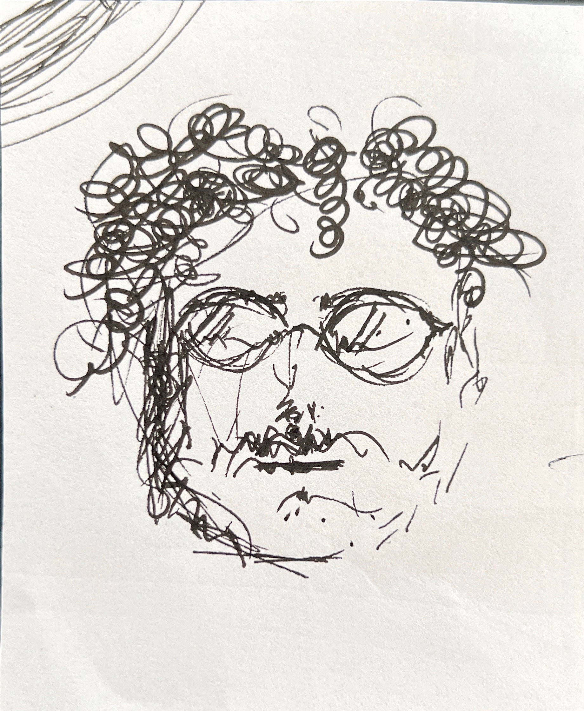

# who is ahmed?

usually a curious, sometimes anxious, designer.

i have multiple interests in life, but lately i have really been trying to find myself away from the corporate/commercial reality. i am so tired of working for money - i want to work for a purpose, instead.

 my title as an architect gives me the respect and skill to help change reality for many people. our studies/experience helped realize the importance of designing for an end user.

 i truly just want to use my skill to make a positive change in the world.

 is it a selfish goal to want to change someone else's life, in order to find purpose? that is for me to find out. but hopefully not :)

 __AY

Lorem ipsum dolor sit amet, consectetur adipiscing elit **[my website](https://community.emergentfutures.io/courses/5566525/content)**
