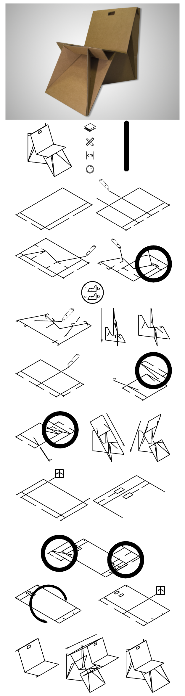
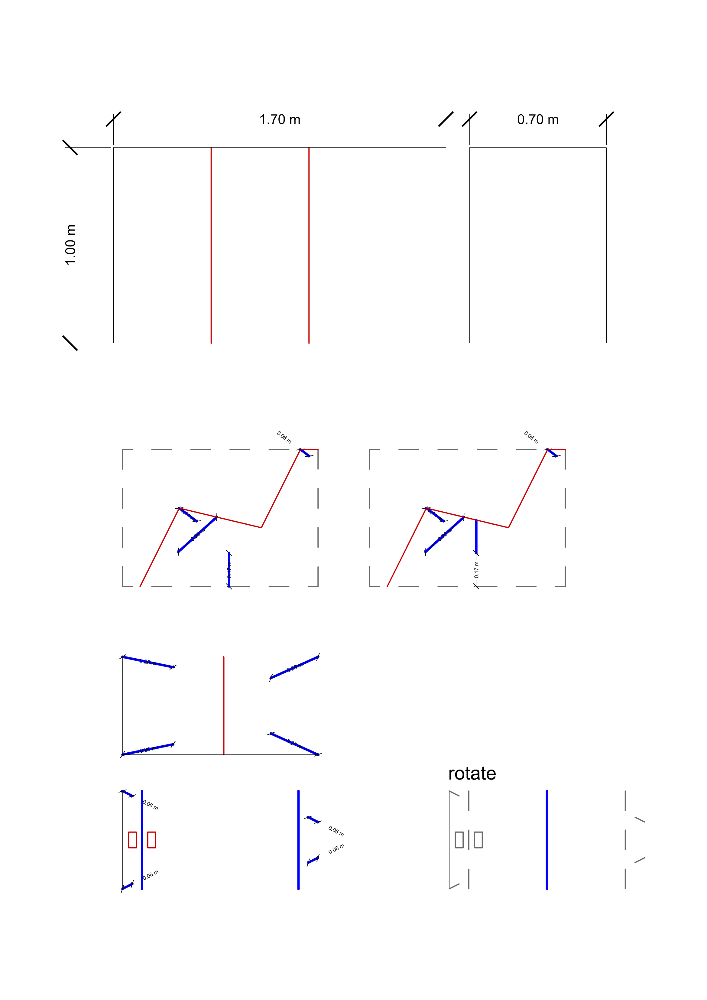

---
hide:
    - toc
---

# interventions

## 01_intervention - just-make series_tote
november 2022

<iframe width="910" height="512" src="https://www.youtube.com/embed/cmkV1NR8Gg0" title="221106_Just-Make-Series_001_Tote-Bag" frameborder="0" allow="accelerometer; autoplay; clipboard-write; encrypted-media; gyroscope; picture-in-picture" allowfullscreen></iframe>

the challenge now was to design a certain article, whether it be a pair of pants or a tote bag (keep in mind that i have no prior experience in textiles) and invite a few people to join this small intervention to create a small intimate workshop (without assessing their skills prior). this idea of a small "production party" - prodparty for short (coined by our friend - korbi). also acted as a small networkijng event. we all talked, learned, understood and shared a decent amount of information, both related to the workshop and not. 

## 02_intervention - just-make series_clay cup
november_2022

<iframe width="1250" height="703" src="https://www.youtube.com/embed/H74tl_v62FQ" title="221123_Just-Make-Series_002_Clay-Cup" frameborder="0" allow="accelerometer; autoplay; clipboard-write; encrypted-media; gyroscope; picture-in-picture" allowfullscreen></iframe>

the idea of this small worshop was to understand the basics of a 3D printer - clay to be specific. the challenge was to get familiar with the material and educate about the basics of deisgning a basic cup on a digital software - we used rhino 3d - and then using the digital software "slice" the model to create stackable layers in order to articulate the object in 3 dimensions. 

## 03_intervention - just-make series_cardboard furniture
december_2022

a third step for us was to evaluate the quality of the online education as non-makers. we did some research to find what is easily accessible for everyone. caglar had the most experience with this as his background is industrial design, i understood how to read drawings clearly. we invited our colleagues to evaluate this experience. 

we found this cardboard chair - becasue 1. its cheap and 2. all its ionformation is accessible online. check out **[the chair](https://www.instructables.com/One-Piece-Cardboard-Chair/)** if you want :)

    initial steps looked like this_

    after simplifying the template for printing

 

## 04_intervention - just-make series_tote 2.0
december_2022

wip

__AY 