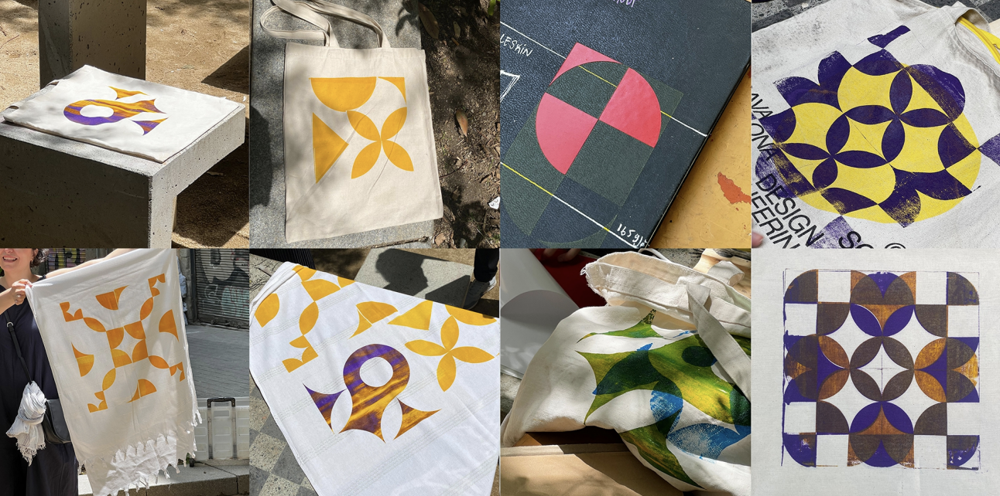

---
hide:
    - toc
---

# interventions

## testing-phase;

### 01_intervention - just-make series_tote
november_2022

<iframe width="910" height="512" src="https://www.youtube.com/embed/cmkV1NR8Gg0" title="221106_Just-Make-Series_001_Tote-Bag" frameborder="0" allow="accelerometer; autoplay; clipboard-write; encrypted-media; gyroscope; picture-in-picture" allowfullscreen></iframe>

the challenge now was to design a specific article, whether it be a pair of pants or a tote bag (keeping in mind that i have no prior experience in textiles), and invite a few people to join this small intervention to create a close, intimate workshop (without assessing their skills beforehand). this idea of a small "production party" - "prodparty" for short (coined by our friend, korbi) - also acted as a networking event. we all talked, learned, understood, and shared a significant amount of information, both related to the workshop and unrelated.

### 02_intervention - just-make series_clay cup
november_2022

<iframe width="1250" height="703" src="https://www.youtube.com/embed/H74tl_v62FQ" title="221123_Just-Make-Series_002_Clay-Cup" frameborder="0" allow="accelerometer; autoplay; clipboard-write; encrypted-media; gyroscope; picture-in-picture" allowfullscreen></iframe>

the idea of this small workshop was to understand the basics of a 3d printer - clay to be specific. the challenge was to get familiar with the material and educate about the basics of designing a basic cup on a digital software - we used rhino 3d - and then using the digital software "slice" the model to create stackable layers in order to articulate the object in 3-dimensions.

### 03_intervention - just-make series_cardboard furniture
december_2022

a third step for us was to evaluate the quality of the online education as non-makers. we did some research to find what is easily accessible for everyone. caglar had the most experience with this as his background is industrial design, i understood how to read drawings clearly. we invited our colleagues to evaluate this experience.

we found this cardboard chair - because 1. its cheap and 2. all its information is accessible online. check out **[the chair](https://www.instructables.com/One-Piece-Cardboard-Chair/)** if you want :)

overall i thought the steps were far too complicated to be read clearly - also i realized the lack of any cad drawings (with clear dimensions/angles) could be challenging for some people to follow along with. 

    initial steps looked like this_

    after simplifying the template for printing

  <iframe loading="lazy" style="position: absolute; width: 100%; height: 100%; top: 0; left: 0; border: none; padding: 0;margin: 0;"
    src="https:&#x2F;&#x2F;www.canva.com&#x2F;design&#x2F;DAFrmtnRpIo&#x2F;view?embed" allowfullscreen="allowfullscreen" allow="fullscreen">
  </iframe>

<a href="https:&#x2F;&#x2F;www.canva.com&#x2F;design&#x2F;DAFrmtnRpIo&#x2F;view?utm_content=DAFrmtnRpIo&amp;utm_campaign=designshare&amp;utm_medium=embeds&amp;utm_source=link" target="_blank" rel="noopener">03_cardboard-furniture</a> by _AY

### 04_intervention - just-make series_tote 2.0
december_2022

lastly, our final involvement took place during a workshop organized by cdef - caixa d’eines i feines - a collaborative platform - we only took part, we did not organize anything. this workshop encompassed more than sewing; it centered around the exchange of knowledge, tools, materials, and care among participants. throughout the event, valuable insights were shared during the course of a single evening.

drawing upon collective sewing experience and expertise, the group aimed to inspire each other to explore the use of a sewing machine. for one member, it marked their first experience with machine sewing. collaboratively, various items were repaired, and a fabric shopping bag was successfully crafted – a project previously attempted by hand. this process highlighted the substantial impact of accumulated experience and clearer instructions on the final outcome.

## application phase;

### mkrspc_tile deco - development
march/june_2023

*play in the physical - convert to the digital*

#### project alignment
we started sharing our interests and discussing the fields we wanted to investigate in order to implement them into our interventions. these three circles illustrate the intersection of our main interests.

    // defining key concepts_

      - diy projects
      - fabrication
      - modular
      - digital crafts
      - making/production
      - gamification

based on these concepts, we determined that we wanted to delve into the modularity of diy design. specifically, we aimed to explore how to simplify the design process by employing a clear methodology that combines physical and digital tools. to accomplish this, we established three stages:

**stage 1** - 2D design pattern

**stage 2** - 3D transformation iteration

**stage 3** - interactive public workshop

#### **project development**

initially, we discussed both 3D and 2D options, and ultimately decided to concentrate on the 2D alternative. for a basic tile decoration, we required vinyl designs that would be attached to a stencil to transfer the ceramic ink. rather than supplying pre-made patterns, stickers, or vinyls, we opted to create a grid board that would enable users to create their own distinct designs.

based on these concepts, we determined that we wanted to explore the modularity of DIY design. specifically, we aimed to explore how to simplify the design process.

#### prototype #1 - tile deco

  <iframe loading="lazy" style="position: absolute; width: 100%; height: 100%; top: 0; left: 0; border: none; padding: 0;margin: 0;"
    src="https:&#x2F;&#x2F;www.canva.com&#x2F;design&#x2F;DAFavYB6CeY&#x2F;view?embed" allowfullscreen="allowfullscreen" allow="fullscreen">
  </iframe>

<a href="https:&#x2F;&#x2F;www.canva.com&#x2F;design&#x2F;DAFavYB6CeY&#x2F;view?utm_content=DAFavYB6CeY&amp;utm_campaign=designshare&amp;utm_medium=embeds&amp;utm_source=link" target="_blank" rel="noopener">Tile Deco</a> by caglaralkan

check out the full detailed process here **[here](https://help-ay.github.io/MDEF/term-2/fab-academy/04_micro-challenges/)** if you want :) and the link to the github repo here **[here](https://github.com/paresmarc/tiledeco)**

#### prototype #2 - tile deco 2.0 (pixel-cubes)
*from 2D to 3D*

    // key concepts 2.0_

    - create digital models through physical interaction
    - how to transform a difficult process into a game
    - how to define a DIY Kit to allow everyone to create 3D models
    - create a process between physical and digital.

  <iframe loading="lazy" style="position: absolute; width: 100%; height: 100%; top: 0; left: 0; border: none; padding: 0;margin: 0;"
    src="https:&#x2F;&#x2F;www.canva.com&#x2F;design&#x2F;DAFddcJntxw&#x2F;view?embed" allowfullscreen="allowfullscreen" allow="fullscreen">
  </iframe>

<a href="https:&#x2F;&#x2F;www.canva.com&#x2F;design&#x2F;DAFddcJntxw&#x2F;view?utm_content=DAFddcJntxw&amp;utm_campaign=designshare&amp;utm_medium=embeds&amp;utm_source=link" target="_blank" rel="noopener">Pixel Cubes</a> by Marc Parés

check out the full detailed process here **[here](https://help-ay.github.io/MDEF/term-2/fab-academy/04_micro-challenges/)** if you want :) and the link to the github repo here **[here](https://github.com/paresmarc/pixelcubes)**

  <iframe loading="lazy" style="position: absolute; width: 100%; height: 100%; top: 0; left: 0; border: none; padding: 0;margin: 0;"
    src="https:&#x2F;&#x2F;www.canva.com&#x2F;design&#x2F;DAFrya-7GEk&#x2F;view?embed" allowfullscreen="allowfullscreen" allow="fullscreen">
  </iframe>

<a href="https:&#x2F;&#x2F;www.canva.com&#x2F;design&#x2F;DAFrya-7GEk&#x2F;view?utm_content=DAFrya-7GEk&amp;utm_campaign=designshare&amp;utm_medium=embeds&amp;utm_source=link" target="_blank" rel="noopener">design dialouges ii</a> by _AY

in the grand scheme, we had a chance to showcase and test *pixel-cubes* during design dialogues ii. we also applied textile screen-printing as part of our outcomes. our visitors mostly found the concept pretty intriguing and useful as a bridge between the real and digital realms. when we tried to get across our main aim - which is to back up maker spaces and diy projects by making digital tools user-friendly and accessible - our effort started to click.

    the comments, feedback, and questions that stood out were:

    1. being able to model or 3d print without being a 3d modeling whiz.
    2. what's the next step to explore?
    3. streamlining both digital and physical processes.
    4. mixing the physical and digital worlds through a human-machine interface.
    5. zoning in on the connections and gaps between these two worlds, and making digital fabrication less of a head-scratcher.
    6. any chance this concept helps visually impaired folks in designing?
    7. can we simplify design processes for everyone and make them more accessible?
    8. it might be nifty to recognize those fiducials in the real world to get a feel for things.

updating our vision and plan, we're thinking about giving our concept a spin within communities like "caixa d’eines y feines" that rally behind maker spaces and offer tools and workshops to individuals.

#### **project development 2.0**

firstly, we talked on 3D and 2D options and then we decided to focus on 2D option. Digital Tiles is a process to design tile paterns while playing with physical shapes. Then, generating a vectorised file you can 3D print a mould for hydraulic press production process to produce tiles in a easy and personal way.

#### prototype #3 - tile deco 3.0 (digital-tiles)
*testing to real-life application*

we applied the same fundamentals steps to perfect the application/process - simplifying and enhancing the 2d (physical) to 3d (digital) relationship of the design. creating with the same process two different outcomes. 1. a 2d stencil for screen-printing 2. a 3d stencil for hydraulic tile printing. 

  <iframe loading="lazy" style="position: absolute; width: 100%; height: 100%; top: 0; left: 0; border: none; padding: 0;margin: 0;"
    src="https:&#x2F;&#x2F;www.canva.com&#x2F;design&#x2F;DAFmXSLLBpo&#x2F;view?embed" allowfullscreen="allowfullscreen" allow="fullscreen">
  </iframe>

<a href="https:&#x2F;&#x2F;www.canva.com&#x2F;design&#x2F;DAFmXSLLBpo&#x2F;view?utm_content=DAFmXSLLBpo&amp;utm_campaign=designshare&amp;utm_medium=embeds&amp;utm_source=link" target="_blank" rel="noopener">iii_tile-design_process</a> by _AY

### 06_internvention - pattern making and textile printing

#### 01_@mkrspc x caixa d’eines y feines

as we planned after the second term, we went ahead and did some tests with our gadget and design idea. our main focus, like we said before, is all about helping out those maker spaces and getting folks into using digital tools for their creative projects.

we took our device from flat to 3d, making it even cooler. we brainstormed some other ways to use it too. when we tried it out, we wanted to keep things hands-on and practical, you know? we were looking at stuff like how easy it is to try out and if it actually makes sense. that led us to two cool ideas: making designs for screen-printing and playing around with hydraulic tiles.

so, we teamed up with caixa d’eines y feines for a screen-printing workshop. but things didn't go as planned – there was a rainstorm and the school was flooded with rain and we were unable to gather the needed equipment. luckily, we had prepared precut stencils and some of the screenprinting equipment gathered. 

we explained how to stick the vinyl onto the frame with tape and gave a demo using tweezers, scissors, and other stuff we brought.

 only four people showed up for the workshop (due to the weather conditions). they came prepared with their own fabric. we wanted them to lead the way and follow their creative process. after we got the stencils onto the frames, they picked their colors, and the screen-printing began. that is what caixa d’eines y feines stand for – they're all about supporting makers and helping the community. 

  <iframe loading="lazy" style="position: absolute; width: 100%; height: 100%; top: 0; left: 0; border: none; padding: 0;margin: 0;"
    src="https:&#x2F;&#x2F;www.canva.com&#x2F;design&#x2F;DAFryhn4Ksw&#x2F;view?embed" allowfullscreen="allowfullscreen" allow="fullscreen">
  </iframe>

<a href="https:&#x2F;&#x2F;www.canva.com&#x2F;design&#x2F;DAFryhn4Ksw&#x2F;view?utm_content=DAFryhn4Ksw&amp;utm_campaign=designshare&amp;utm_medium=embeds&amp;utm_source=link" target="_blank" rel="noopener">intervention-i</a> by _AY

#### 02_@mkrspc x caixa d’eines y feines

just as we planned, we organized a second screen printing workshop at the cdef anniversary bash. this was our chance to put our gadget, which we developed during the past few months, to the test – we called it the phygital therapy - wip imo. we had more than 30 makers from all kinds of backgrounds, from architects to finance folks.

we gave a quick rundown of what the workshop was all about and got everyone clued in on the gear and how things would roll. i led the way, showing how to work the system for designing. meanwhile, marc pares and caglar alkan tackled the vinyl cutting and got the stencils ready for the screen printing process.

  <iframe loading="lazy" style="position: absolute; width: 100%; height: 100%; top: 0; left: 0; border: none; padding: 0;margin: 0;"
    src="https:&#x2F;&#x2F;www.canva.com&#x2F;design&#x2F;DAFsEkcqxpQ&#x2F;view?embed" allowfullscreen="allowfullscreen" allow="fullscreen">
  </iframe>

<a href="https:&#x2F;&#x2F;www.canva.com&#x2F;design&#x2F;DAFsEkcqxpQ&#x2F;view?utm_content=DAFsEkcqxpQ&amp;utm_campaign=designshare&amp;utm_medium=embeds&amp;utm_source=link" target="_blank" rel="noopener">intervention-ii</a> by _AY

while the prototype had room for improvement – the detection system wasn't as precise as we aimed for – participants still had a blast crafting their own designs using the physical pieces and witnessing the quick digital transformation. while creating, participants shared some insightful feedback. the magnets in the grid brought a bit of confusion, since they restricted item placement. we explained that grasshopper picked up shapes via the magnets in the center of each square, which cleared things up. still, loads of fantastic and one-of-a-kind designs emerged.

collaborating with caixa d’eines got us noticed, drawing plenty of curious folks eager to take part. plus, being in a public park meant passersby wanted in on the action too. a crew of urban sketchers got super into it and even used screen-printing to get a momento of their trip to barcelona in their notebooks.

#### 03_@mkrspc x ateneu de fabricació la fàbrica del sol

this was our final workshop, wrapping up the mdefest. we're gonna run another round of screen-printing, this time using the polished prototype. to pull this off, we teamed up with ateneu de fabricació de la fàbrica del sol. they're all about curating workshops, spreading the word on digital fabrication, and providing folks up with tools to make cool projects happen that would otherwise be impossible to do.

<blockquote class="instagram-media" data-instgrm-permalink="https://www.instagram.com/p/CtzU0mPrivR/?utm_source=ig_embed&amp;utm_campaign=loading" data-instgrm-version="14" style=" background:#FFF; border:0; border-radius:3px; box-shadow:0 0 1px 0 rgba(0,0,0,0.5),0 1px 10px 0 rgba(0,0,0,0.15); margin: 1px; max-width:540px; min-width:326px; padding:0; width:99.375%; width:-webkit-calc(100% - 2px); width:calc(100% - 2px);">
 <a href="https://www.instagram.com/p/CtzU0mPrivR/?utm_source=ig_embed&amp;utm_campaign=loading" style=" background:#FFFFFF; line-height:0; padding:0 0; text-align:center; text-decoration:none; width:100%;" target="_blank"> 
 

 
 

 

 
<svg width="50px" height="50px" viewBox="0 0 60 60" version="1.1" xmlns="https://www.w3.org/2000/svg" xmlns:xlink="https://www.w3.org/1999/xlink"><g stroke="none" stroke-width="1" fill="none" fill-rule="evenodd"><g transform="translate(-511.000000, -20.000000)" fill="#000000"><g><path d="M556.869,30.41 C554.814,30.41 553.148,32.076 553.148,34.131 C553.148,36.186 554.814,37.852 556.869,37.852 C558.924,37.852 560.59,36.186 560.59,34.131 C560.59,32.076 558.924,30.41 556.869,30.41 M541,60.657 C535.114,60.657 530.342,55.887 530.342,50 C530.342,44.114 535.114,39.342 541,39.342 C546.887,39.342 551.658,44.114 551.658,50 C551.658,55.887 546.887,60.657 541,60.657 M541,33.886 C532.1,33.886 524.886,41.1 524.886,50 C524.886,58.899 532.1,66.113 541,66.113 C549.9,66.113 557.115,58.899 557.115,50 C557.115,41.1 549.9,33.886 541,33.886 M565.378,62.101 C565.244,65.022 564.756,66.606 564.346,67.663 C563.803,69.06 563.154,70.057 562.106,71.106 C561.058,72.155 560.06,72.803 558.662,73.347 C557.607,73.757 556.021,74.244 553.102,74.378 C549.944,74.521 548.997,74.552 541,74.552 C533.003,74.552 532.056,74.521 528.898,74.378 C525.979,74.244 524.393,73.757 523.338,73.347 C521.94,72.803 520.942,72.155 519.894,71.106 C518.846,70.057 518.197,69.06 517.654,67.663 C517.244,66.606 516.755,65.022 516.623,62.101 C516.479,58.943 516.448,57.996 516.448,50 C516.448,42.003 516.479,41.056 516.623,37.899 C516.755,34.978 517.244,33.391 517.654,32.338 C518.197,30.938 518.846,29.942 519.894,28.894 C520.942,27.846 521.94,27.196 523.338,26.654 C524.393,26.244 525.979,25.756 528.898,25.623 C532.057,25.479 533.004,25.448 541,25.448 C548.997,25.448 549.943,25.479 553.102,25.623 C556.021,25.756 557.607,26.244 558.662,26.654 C560.06,27.196 561.058,27.846 562.106,28.894 C563.154,29.942 563.803,30.938 564.346,32.338 C564.756,33.391 565.244,34.978 565.378,37.899 C565.522,41.056 565.552,42.003 565.552,50 C565.552,57.996 565.522,58.943 565.378,62.101 M570.82,37.631 C570.674,34.438 570.167,32.258 569.425,30.349 C568.659,28.377 567.633,26.702 565.965,25.035 C564.297,23.368 562.623,22.342 560.652,21.575 C558.743,20.834 556.562,20.326 553.369,20.18 C550.169,20.033 549.148,20 541,20 C532.853,20 531.831,20.033 528.631,20.18 C525.438,20.326 523.257,20.834 521.349,21.575 C519.376,22.342 517.703,23.368 516.035,25.035 C514.368,26.702 513.342,28.377 512.574,30.349 C511.834,32.258 511.326,34.438 511.181,37.631 C511.035,40.831 511,41.851 511,50 C511,58.147 511.035,59.17 511.181,62.369 C511.326,65.562 511.834,67.743 512.574,69.651 C513.342,71.625 514.368,73.296 516.035,74.965 C517.703,76.634 519.376,77.658 521.349,78.425 C523.257,79.167 525.438,79.673 528.631,79.82 C531.831,79.965 532.853,80.001 541,80.001 C549.148,80.001 550.169,79.965 553.369,79.82 C556.562,79.673 558.743,79.167 560.652,78.425 C562.623,77.658 564.297,76.634 565.965,74.965 C567.633,73.296 568.659,71.625 569.425,69.651 C570.167,67.743 570.674,65.562 570.82,62.369 C570.966,59.17 571,58.147 571,50 C571,41.851 570.966,40.831 570.82,37.631"></path></g></g></g></svg>

 
View this post on Instagram

 

 

 

 

 

 

 

 

 

 
 

 

</a>
<a href="https://www.instagram.com/p/CtzU0mPrivR/?utm_source=ig_embed&amp;utm_campaign=loading" style=" color:#c9c8cd; font-family:Arial,sans-serif; font-size:14px; font-style:normal; font-weight:normal; line-height:17px; text-decoration:none;" target="_blank">A post shared by ATENEU DE FABRICACIÓ (@afabfabricadelsol)</a>

</blockquote> 

__AY 