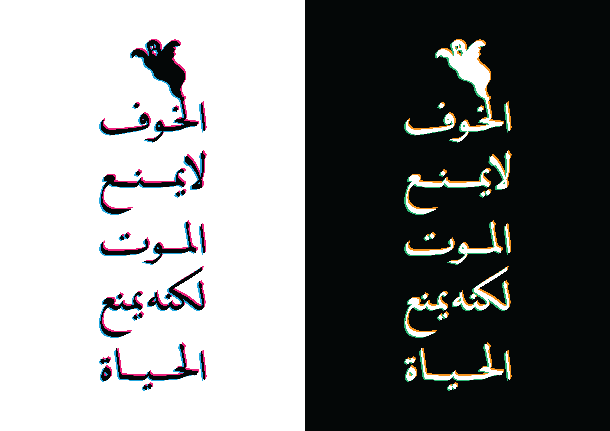

---
hide:
    - toc
---

# what is my fight?
october_2022

lets get a little bit personal.

with everything going on in our modern world, we could get overwhelmed with feelings of anxiety. there is so much wrong with the world that we, as normal everyday people, can not control or so we think.

i found myself struggling to focus on just one issue, so i decided that my first fight would be with my own subconscious. the world is out of control, and that idea frightens me.

by winning the fight inside my head, i will be better suited to use my skills and talents to better serve my community. fear tends to control and render us, humans, as frozen and broken.

the poster is a quote by, 1988 noble prize winner, egyptian writer - najeeb mahfouz - it translates directly to "fear does not prevent death, but it prevents life."

i choose to fight my "fear" and become the maker / do-er / creator i always dreamt of being.

__AY
