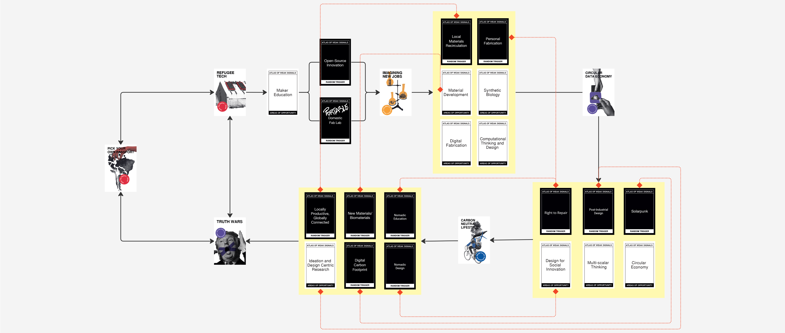
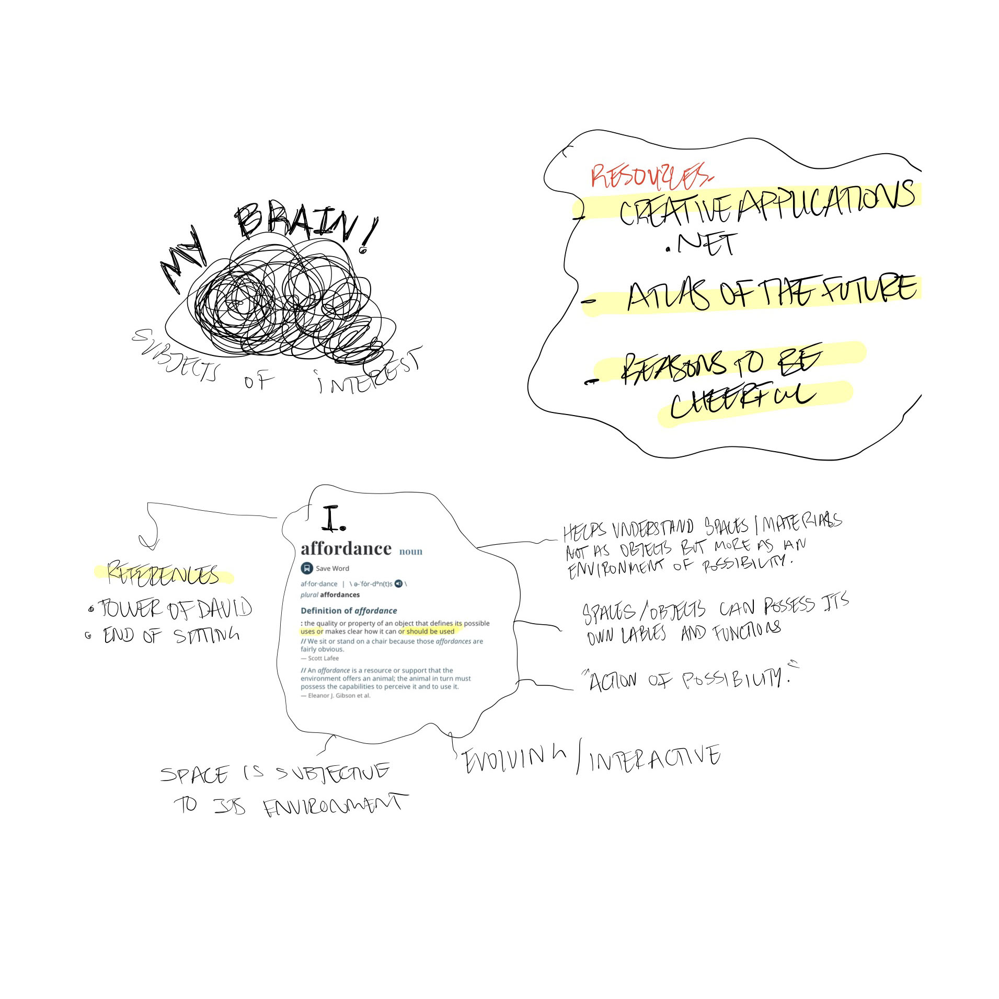

---
hide:
    - toc
---

# atlas of weak signals

my main focus after receiving the atlas of weak signals was solely on the type of positive change we could make for refugees through the education of design thinking. 

by educating people through small interventions to understand the main keys of designing a product on multiple scales. empowering through the process to become makers, fixers, or even creators..

in a way this fight is also against "the imposter syndrome" the fear of not being good enough - the fear of being inadequate - the fear of needing to rely on someone. a bit intangible, but a man can dream.

the refugees of this world have seen too much - i feel a personal duty to somehow "help" / "improve" / "understand". 

__AY