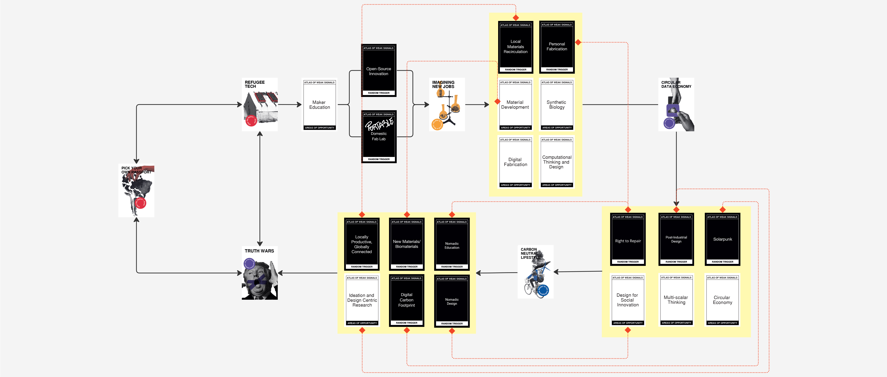
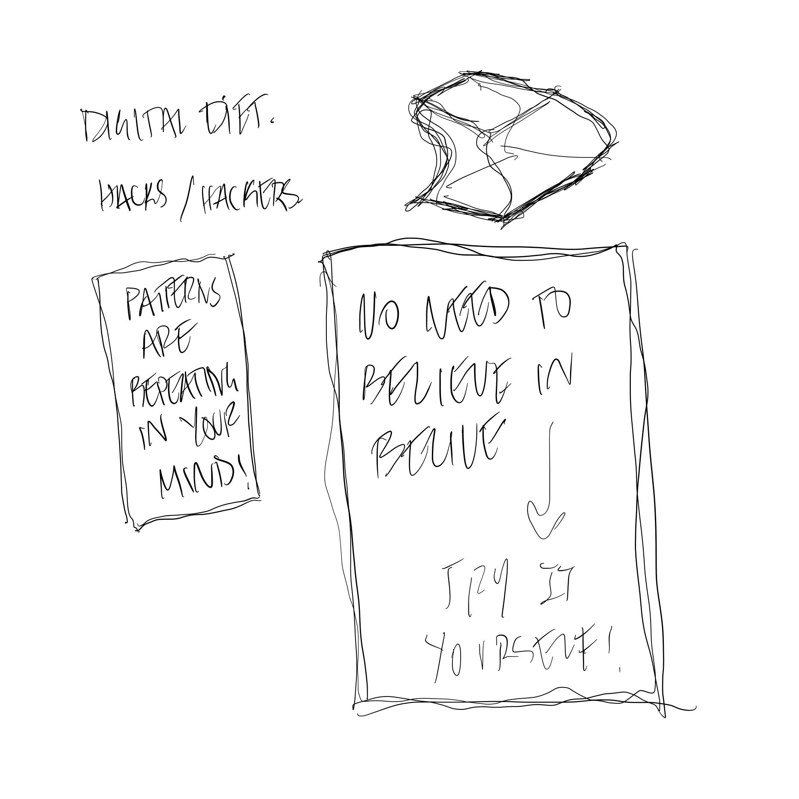

---
hide:
    - toc
---

# atlas of weak signals
october_2022

my primary objective after obtaining the Atlas of Weak Signals was to investigate the potential for creating positive change for refugees through design thinking education.

by providing individuals with a comprehensive understanding of the design process and key principles, i aim to empower them to become proactive agents of change. Through small educational interventions, i believe we can equip people with the tools to design solutions on multiple scales and become makers, problem-solvers, and even creators.

this battle against fear and anxiety is also a fight against the "imposter syndrome," the self-doubt that arises from the fear of not being good enough, capable enough, or self-sufficient enough. while these fears can feel intangible, I am inspired to dream of a world where they no longer hold us back.

the refugees of our world have suffered so much, and I feel a strong sense of personal responsibility to help, support, and understand their experiences. By overcoming my own fears, I hope to become a more effective ally and advocate for those in need. 

__AY