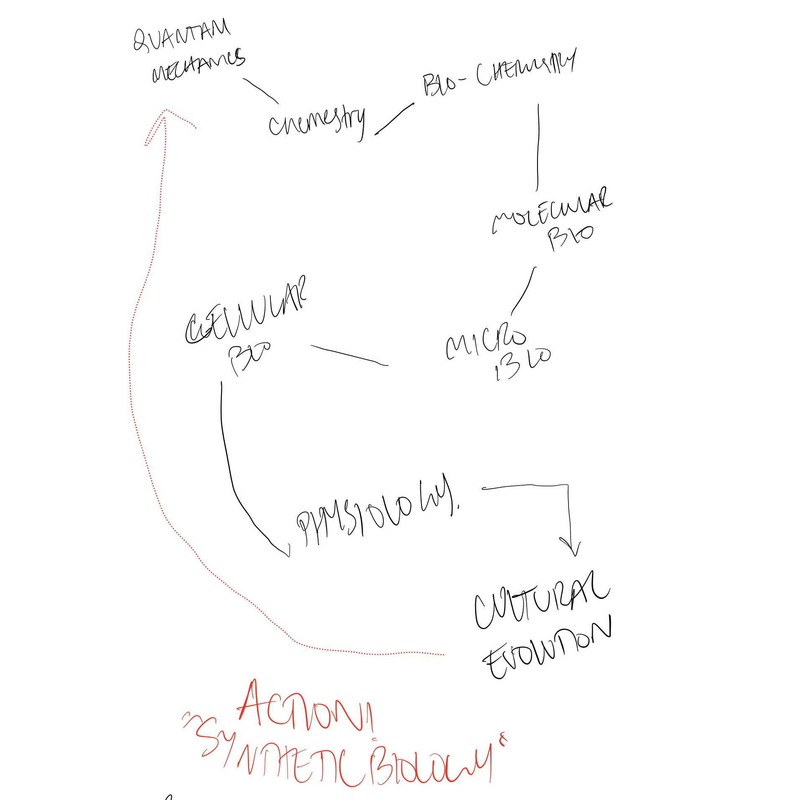
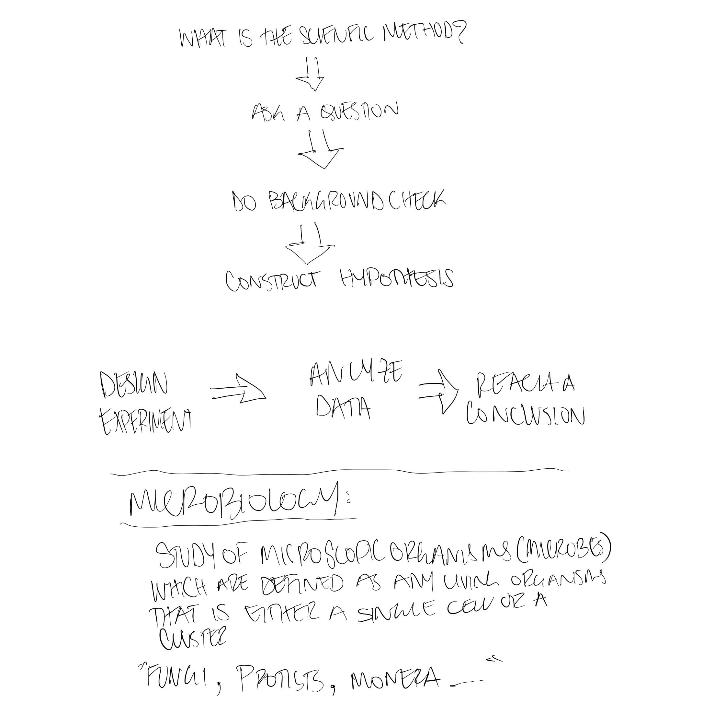
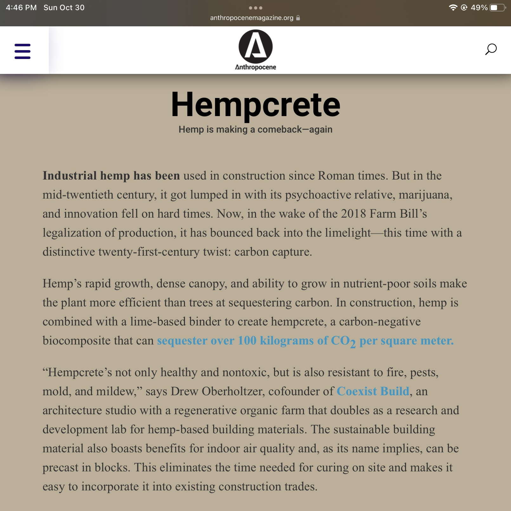

---
hide:
    - toc
---

# the bio & agri zero
october_2022

a journey of the complexity of biology and its basis in the understanding of everyday organisms. quite a pretentious statement for a guy who barely writes. thank you nuria and jordi!

we did learn a lot about diy biology labs and biolabs - through their vast experience in the field of science they devised very simple plans for us to experiment with bioplastics. 

assignment_

article linked **[here.](https://www.anthropocenemagazine.org/2022/01/carbon-negative-construction/)**

issues_ second only to water, concrete is the most used material. concrete is a material that offers strength, duravility, and is very weather resistent. *how do you take a material that is readily available in all the architectural buildings of the world and make it more green? 

the introduction of "hempcrete" which is a composite that mixes hemp (the plant) with a lime-based binder to create this carbon negative material - this material is capable of sequestering 100+ kg of carbon diaoxide per square meter. 

although it is cast the same way concrete is, this new material is no substitute as it struggles a lot with structural integrity to be a peoper load bearing material. it is used as substitutes to drywall or insulation.

it is still a new market as the united states just legalized the industrial hemp production. rather than importing the material from europe, the us market will grow exponentially as the local supply chains grow.

An interesting *article* about the importance of impact of the use of hemp concrete can be found **[here.](https://www.researchgate.net/publication/324647603_Hemp_Concrete_-_A_Traditional_and_Novel_Green_Building_Material)**

it discusses the readily available material and the possible contribution towards the climate change problems.

__AY