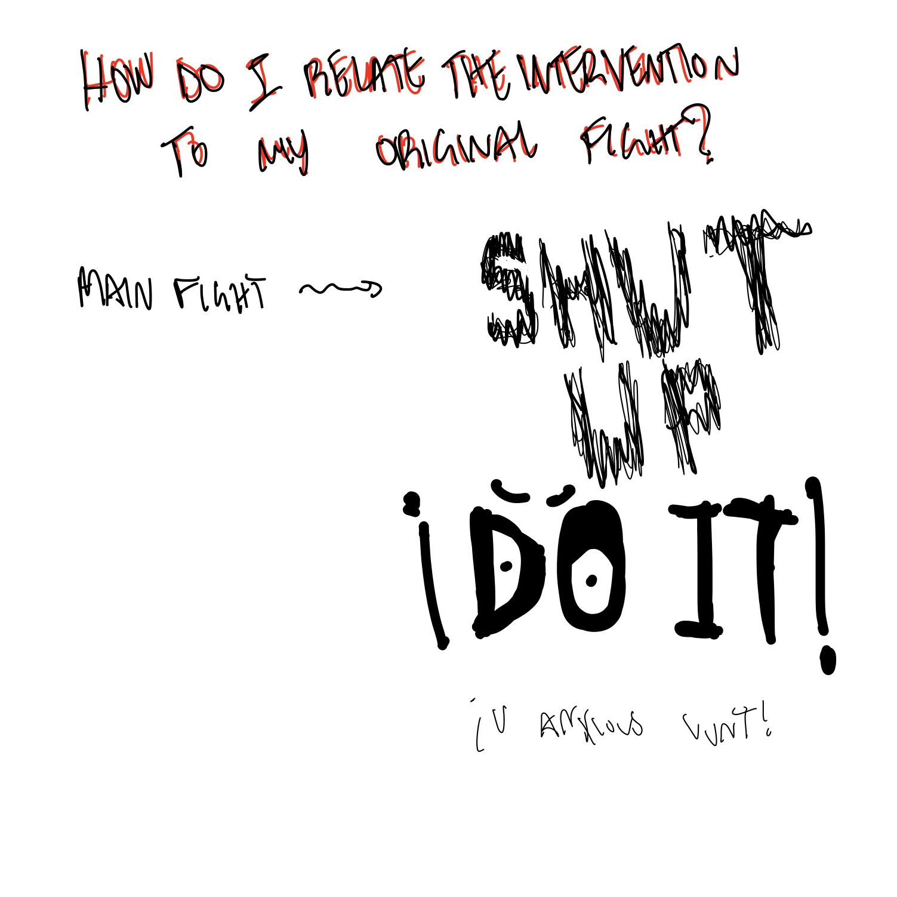
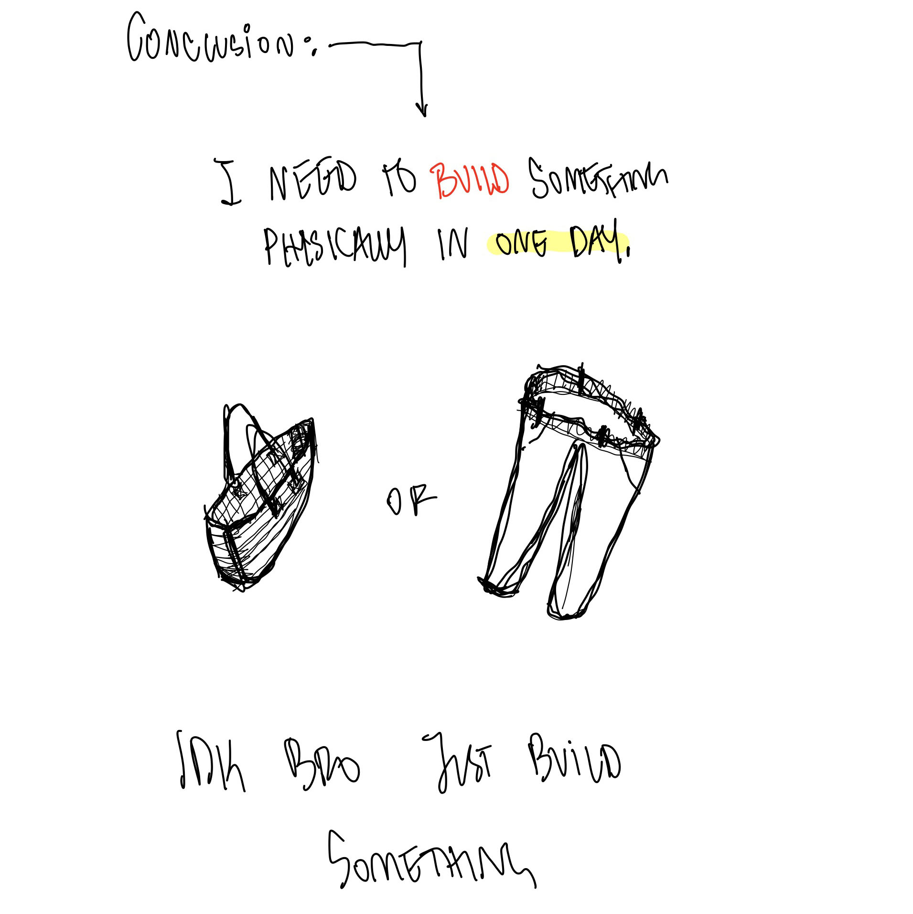

---
hide:
    - toc
---

# living with your own ideas
november_2022

this was week was very interesting.

initially after a couple of weeks of very theoratical-heavy approach - it was fun to get physical with the scrap materials, conceptually.

## make a companion_

the idea of a companion that you create for a certain job was a bit egotistical in my head. i do not like to think of myself as a creator for the sake of creating but rather for a purpose. does this make sense? it does in my head. we can discuss this further - privately.

ANYWAYS.

yes, my "creation" - BOB.

insert image here -

bob was an artifial form of life - almost like a plant, but fake and made out of cardboard, aluminum foil, baking paper, and some zip ties. so yes, a plant, but fake. bob needs to be left in a place with light - like me. bob needed to get some fresh air every now and then - like me. also in a fake way bob needed to be watered - like me (not in a fake way though). 

bob was a reflection of me in an inanimate form type of deal. I took a walk when i needed to. I went and sat in the sun when i needed to. i went and drank water when i needed to. bob acted as the best reminded to care for the simplest things in life. i find it quite hilarious that i "fake" cared for him, also. i opened up the window, placed him in the sun. quite silly but it was interesting.

## first person perspective_

after initially struggling with a focus for the video, the essense of my fight came back to me. what was the thing i wanted to do the most? build - maker - DO.

what do i want to build though? which skill do i wanna learn? who would even enjoy this activity? i asked myself a bunch of questions before i agreed with myself on what to do and how to execute it. 

the challenge now was to design a certain article, whether it be a pair of pants or a tote bag (keep in mind that i have no prior experience in textiles) and invite a few people to join this small intervention to create a small intimate workshop (without assessing their skills prior).

<iframe src="https://player.vimeo.com/video/781286883?h=755b6b5d34&amp;badge=0&amp;autopause=0&amp;player_id=0&amp;app_id=58479" frameborder="0" allow="autoplay; fullscreen; picture-in-picture" allowfullscreen style="position:absolute;top:0;left:0;width:100%;height:100%;" title="221118_Useless-Machine_KnockKnock"></iframe>

we had a lot of fun building and designing the tote bag here - none of us really had any experience with textiles - eventhough Caglar was very profcient with using a needle and thread and he helped us a lot understand how to sew.

a successful intervention? i would say so :)

__AY