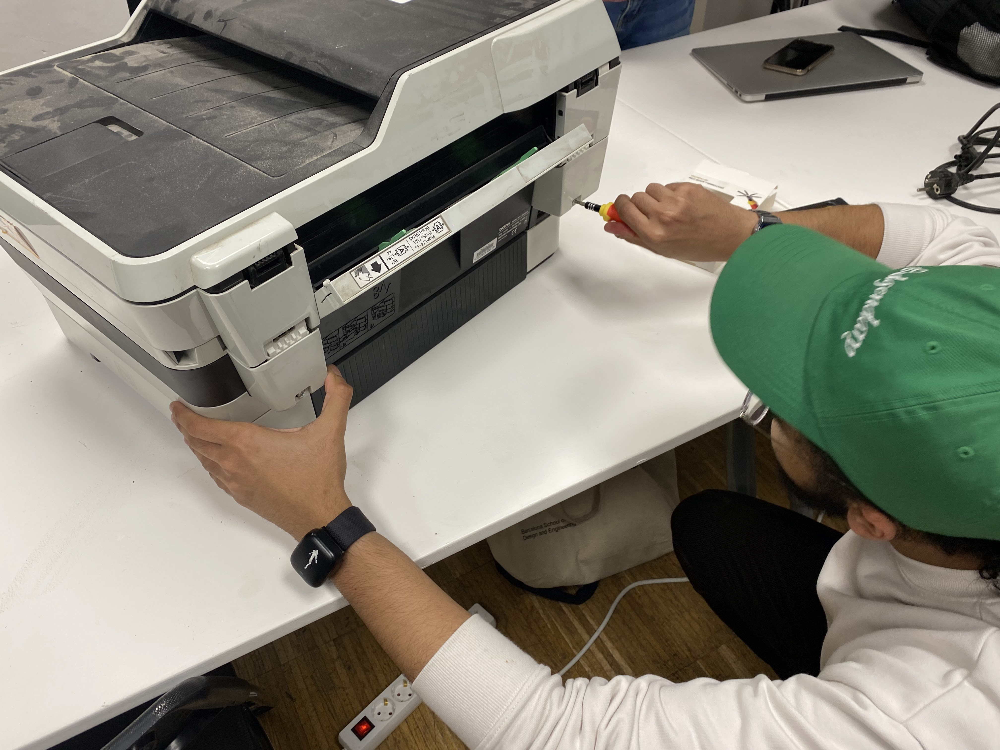
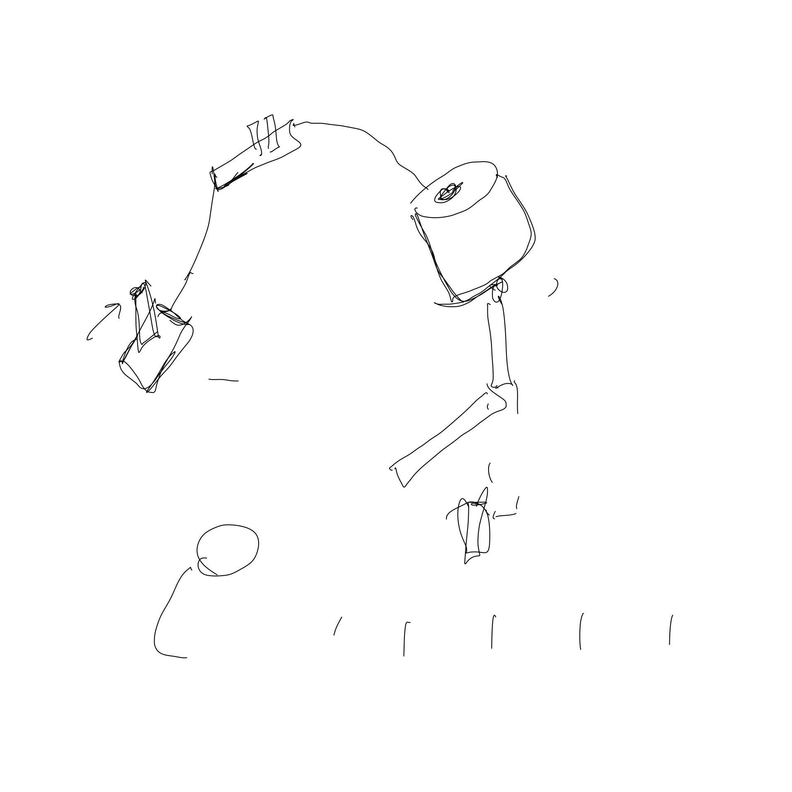
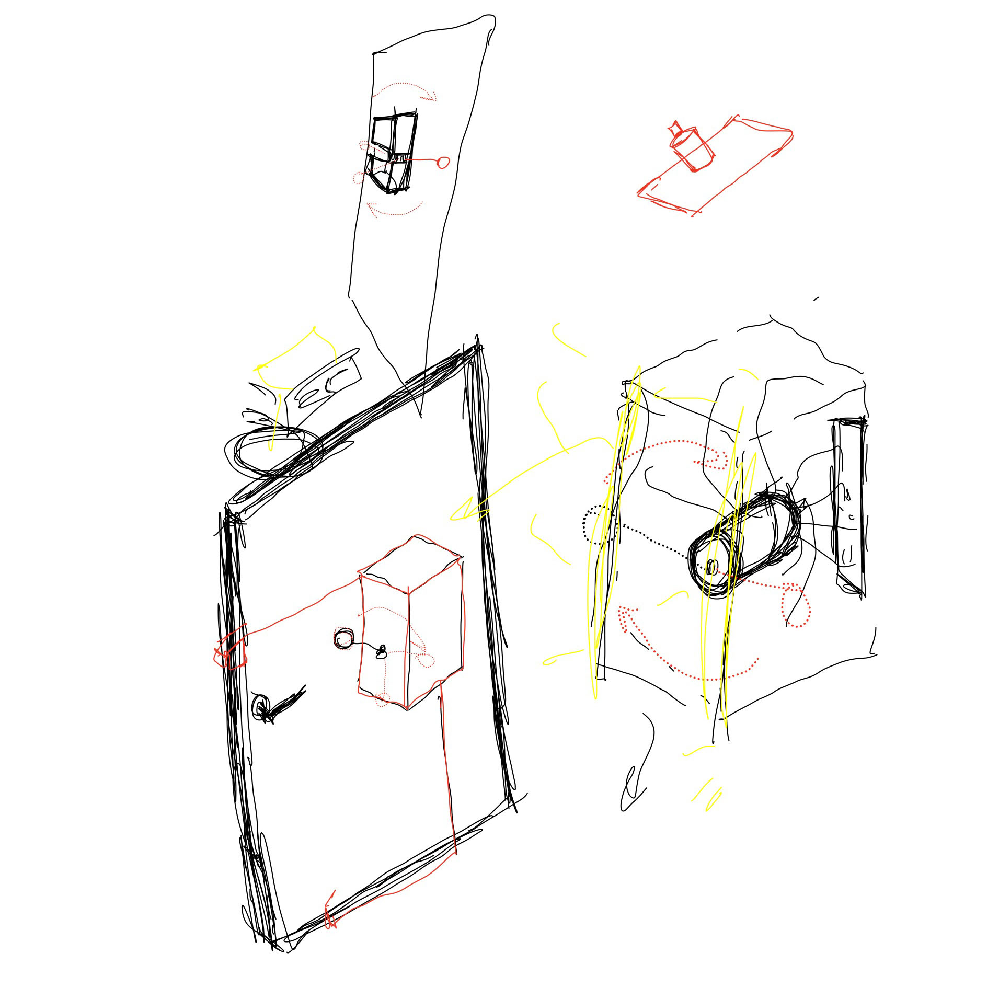
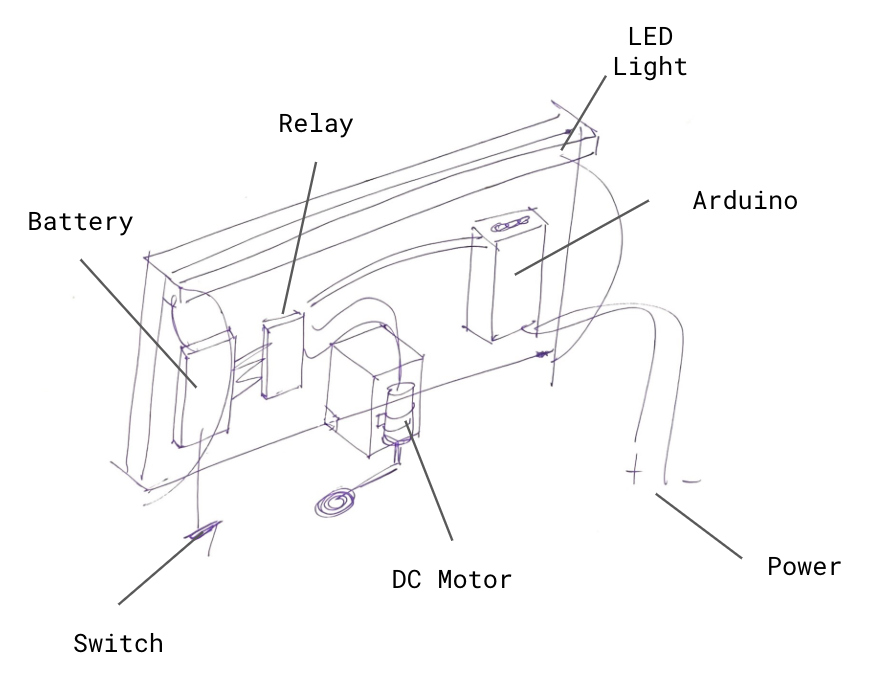
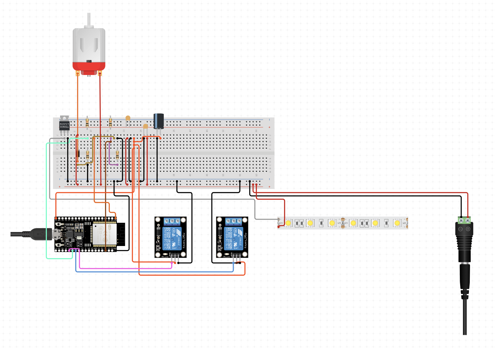

---
hide:
    - toc
---

# tech beyond the myth
november_2022

## forensics of the obsolescense_

last few weeks were a refreshing change - we were introduced to the right to repair. the monolpoly some companies have over their products // this is what i thought was most important to learn and what stuck with me the most.

our first week was spent doing a forensics study - one in which we did a thorough examination of a "broken" device. my group jumped on the idea of breaking down the largest device possible :) a printer/scanner combo - an absolute unit.

it was quite chaotic for me - surprisingly - and it made me quite anxious, the idea of just taking apart the device without prior plan with what to do and how to keep track of the parts - made me uncomfortable. 

i was shocked with the amounts of the inner systems that made the printer work, though. there were plenty of sensors, motors, cameras, lights, ink dispensers, even screens and speakers. a little more you would think it was a store - lol. again, this activity was really about getting comfortable with breaking down a "super complicated" electronic device. we had a lot of fun speculating about what each motor did, and what functions each small little sensor had.

<iframe width="444" height="789" src="https://www.youtube.com/embed/R2PLgbrroc8" title="powered motor" frameborder="0" allow="accelerometer; autoplay; clipboard-write; encrypted-media; gyroscope; picture-in-picture" allowfullscreen></iframe>

we ended with a forensics report which can be found **[here.](https://hackmd.io/IFpmoizIRRygTzq2N4Cxwg?view)**

## the useless machine_

after all the breaking down of the printer, we were tasked with creating a device with all the components that we had. conceptualize - tinker - build.

since we had a lot of motors, our first immediate thought was to create a mechanically moving device. and after a lot of brainstorming we let our inner-child take over.

after making sure the parts were fully functional - we moved forward by creating as marc said "an automatic annoying knocking machine" - it will keep knocking until you answer your door :) // philosophically it was created to interrupt the attack on your attention by the social medias - gives you a reason to get out of the house and enjoy the here and the now.

<iframe width="1250" height="703" src="https://www.youtube.com/embed/1F_JKIxENr4" title="221118_Useless-Machine_KnockKnock" frameborder="0" allow="accelerometer; autoplay; clipboard-write; encrypted-media; gyroscope; picture-in-picture" allowfullscreen></iframe>

the disassembly process was really eye opening for me - the fablab squad were all so wonderful. it really felt like a linear hierarchy here - i felt i was interacting with collegues and friends rather than teachers. they shared their knowledge with us, they helped us out whenever they could - absolutely wonderful! i give it a solid 8.5 out of 10 - would do it again :)

__AY