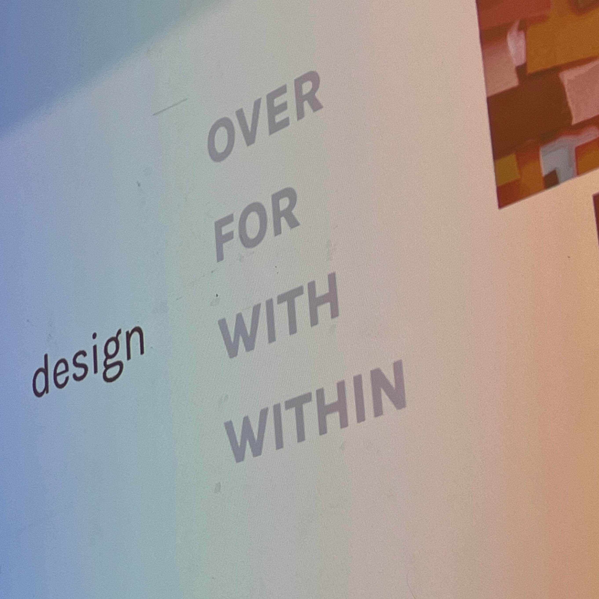
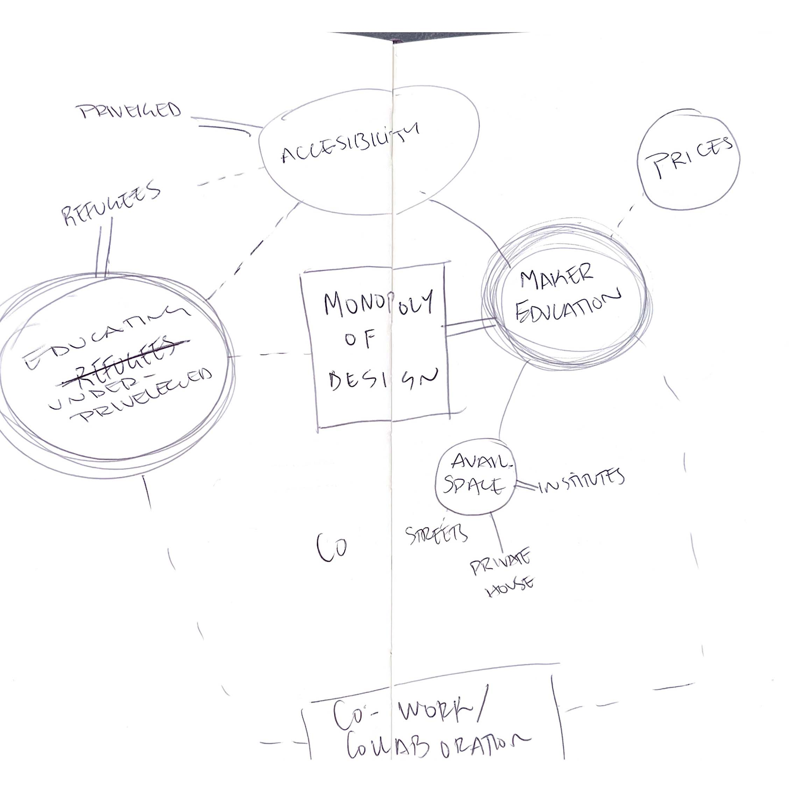
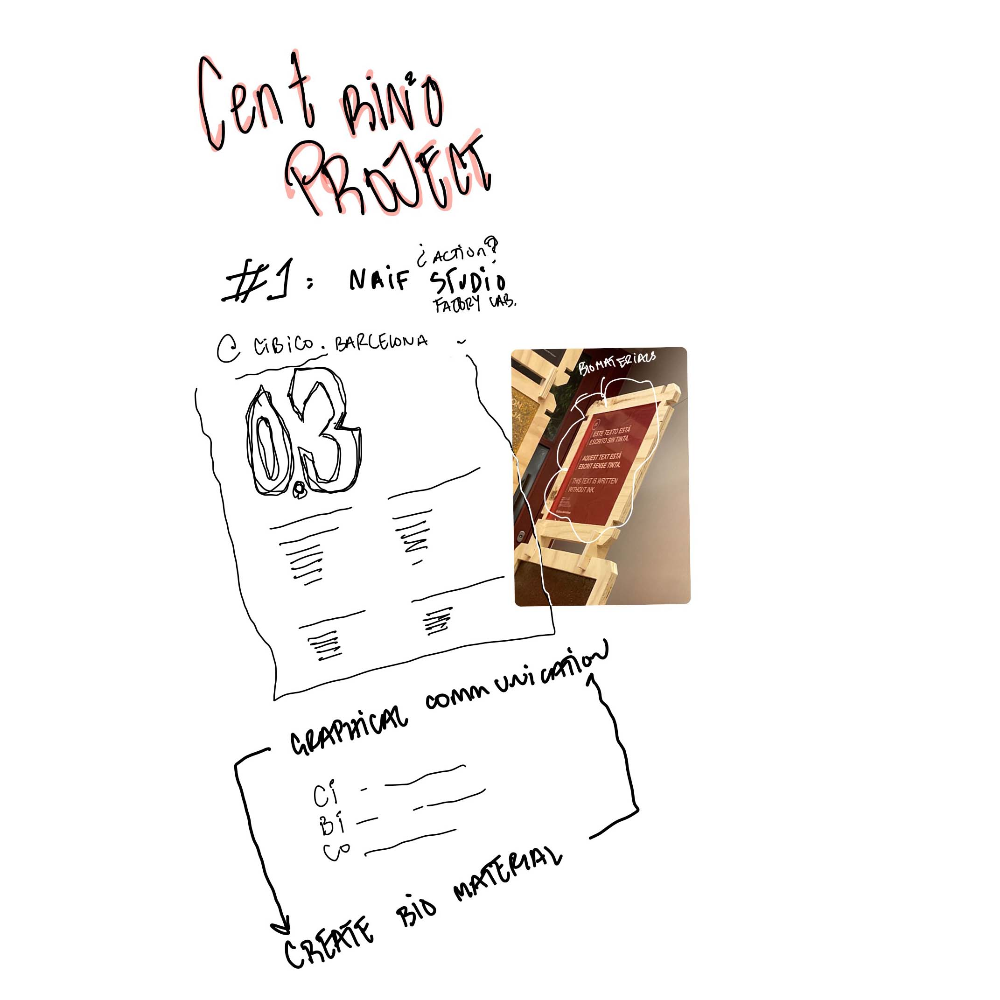

---
hide:
    - toc
---

# community engagement
november_2022

an interesting week - it focused on concepts of designing for a certain community. with a lot of roleplay exersices with helped connect me not only with myself but also with my peers. a lot of the sessions were held in holon - who's moderators were wonderful at assessing and speaking to the class. 

though i am stilll confused about what i am trying to do and who i am trying to do it with/for - one thing is clear. i am interested in "killing the monopoly of design" - it would be wonderful to introduce people to the main concepts of design - in a way to educate them but also to understand the importance of good design. 

in a general sense, the community i would prefer to target is the class of people who wish to re-invent themselves - the group of people stuck doing something they do not like, the people stuck not doing anything at all, the people who want to educate themselves, the people who want to take a break from the real life jobs. i would also like to target a class of refugees - the people who truly struggle the most - who have always wanted to learn a new skill.

we visited a few cool places throughout this week - the one that had the most impact on me was cibico - because they managed to take their niche design practice (space and graphic design) and apply another layer of complexity (niche to it - i.e. the bio material banners. it is one of my dreams to do something similar one day. 

__AY