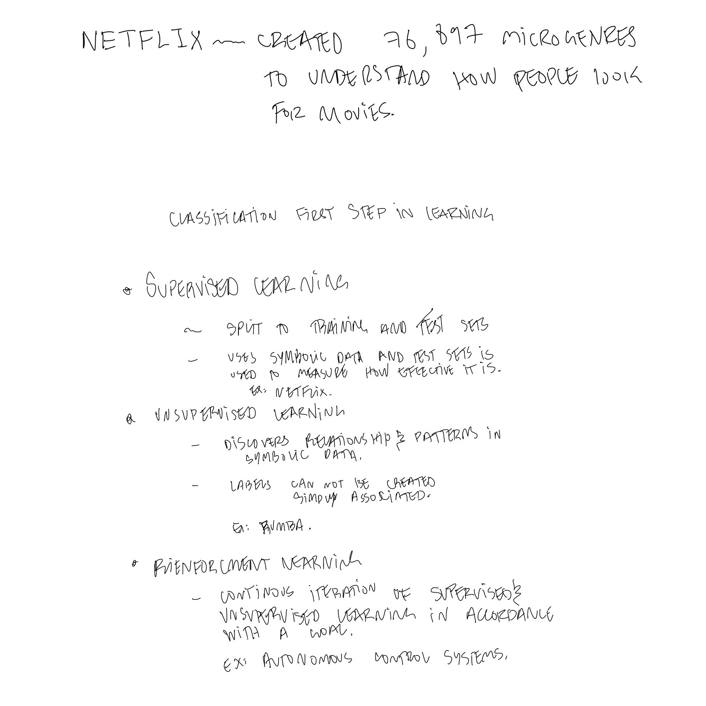
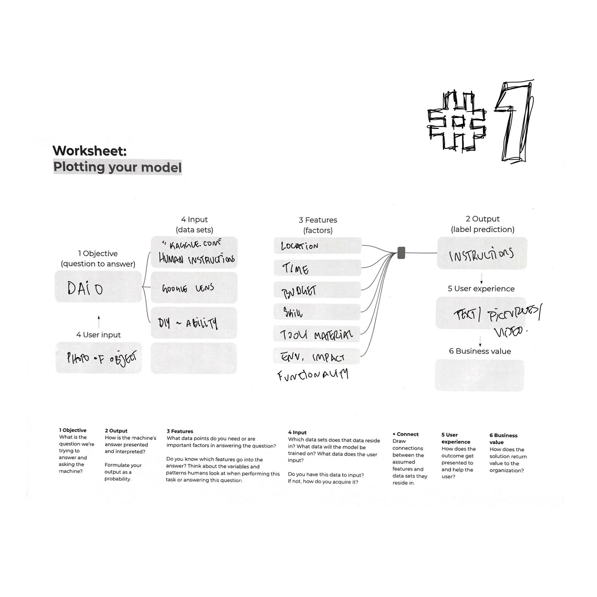
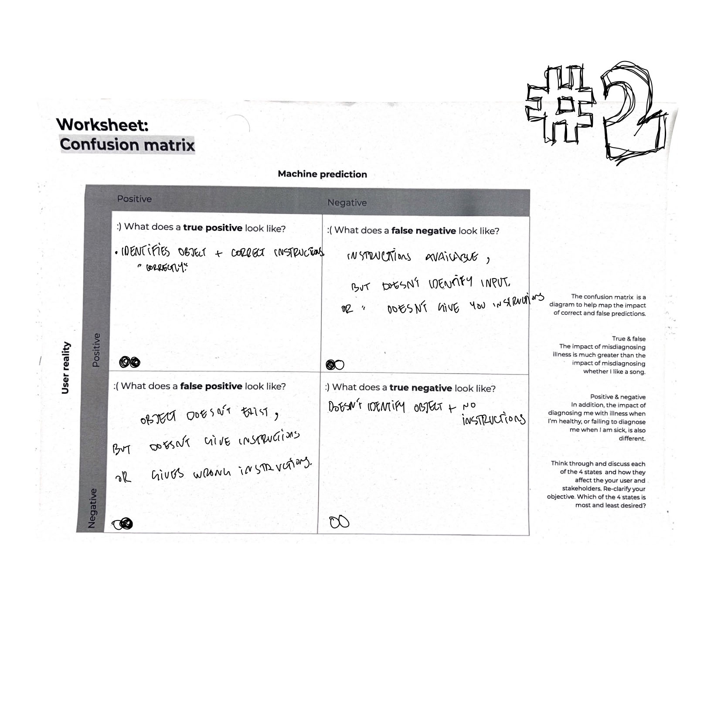

---
hide:
    - toc
---

# extended intelligence
december_2022

I am not a giant fan of AI - solely becasue of the recent boom in AI art, nfts, blochchain - but also i am extremely under educated in this topic. so this module was quite interesting, specially hearing from the experts about the perception, ethics, and capabilities of AI.

the two seminar was quite difficult to digest, purely because of the amount of information that was dumped on us. i felt all these modules (throughout the semester) were an information dump more than anything and you just had to find one small portion of interest to hang on to. for me that was the part about the actual machine learning.

google colab is an easy way to get a quick hands-on experience with AI - the system can be ran remotely without needing a local connection (interesting) - completely safe for your device (interesting) - all available in minutes (interesting/scary). endless possibilities wether it is to identify objects in an image or simulate a human face that does not exist (scary).

the last part of the module was to imagine an AI with a purpose - my group (Amanda, Claudia, Mytro, Korbi, Stella) - we worked on an AI that can take a picture of an object and eventually break it down into small digestable steps of how it is made. the system would take into account the skill of the user, availablity of local materials, complexity of said object and give out a set of instructions to build it themselves at home. interesting in concept - difficult to execute (mainly cuz we are not ai engineers). it is nice to imagine though..

i leave you with this message - try to do it yourself - also (look down)

__AY