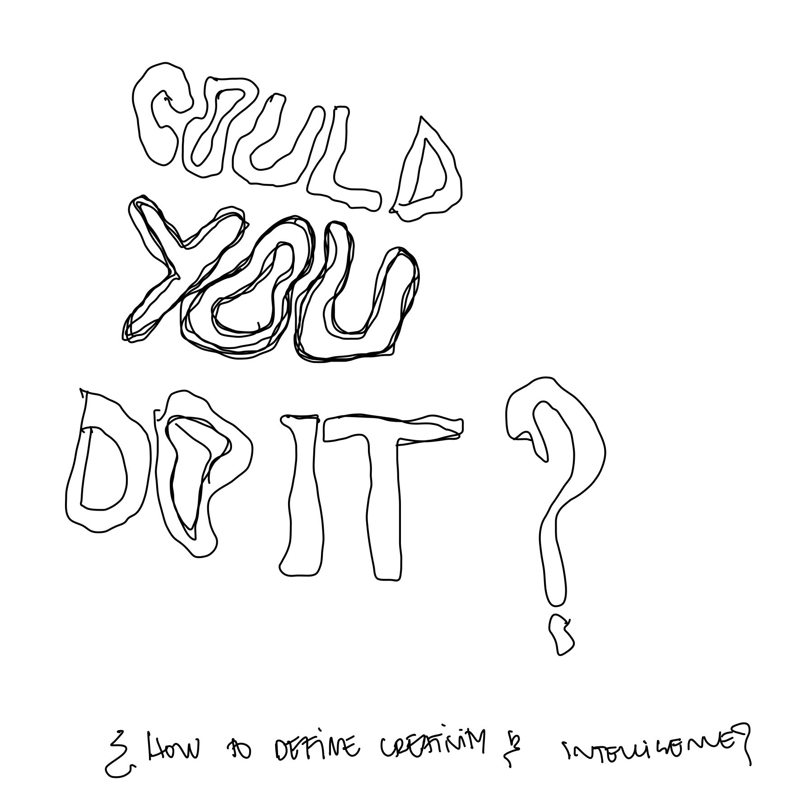

---
hide:
    - toc
---

# extended intelligence
december_2022

i have mixed feelings about Artificial Intelligence. on one hand, the recent surge in AI art, NFTs, and blockchain has made me wary. on the other hand, i acknowledge my limited knowledge and understanding of the topic, making this module particularly intriguing. It was fascinating to listen to experts speak about their perceptions, ethics, and the potential capabilities of AI.

the seminars were a challenge to fully grasp, due to the sheer volume of information presented. throughout the semester, i felt that many of the modules were more like information dumps, and one had to pick and choose what they found most interesting to focus on. in my case, the section on actual machine learning was of particular interest.

google Colab is an accessible platform to gain practical experience with AI. Its remote accessibility, security for your device, and quick setup make it a desirable tool. the possibilities are endless, whether it be identifying objects in an image or generating a fake human face (which can be both exciting and frightening).

the final part of the module tasked us with imagining an AI with a purpose. My group, consisting of Amanda, Claudia, Mytro, Korbi, and Stella, worked on developing an AI that could analyze a picture of an object and then provide a step-by-step guide for how to make it, taking into consideration the user's skill level, availability of materials, and the object's complexity. although the concept was intriguing, executing it was a challenge, particularly because none of us are AI engineers. nonetheless, it was a nice exercise to consider the possibilities.

i leave you with this message - try to do it yourself - also (look down)

__AY