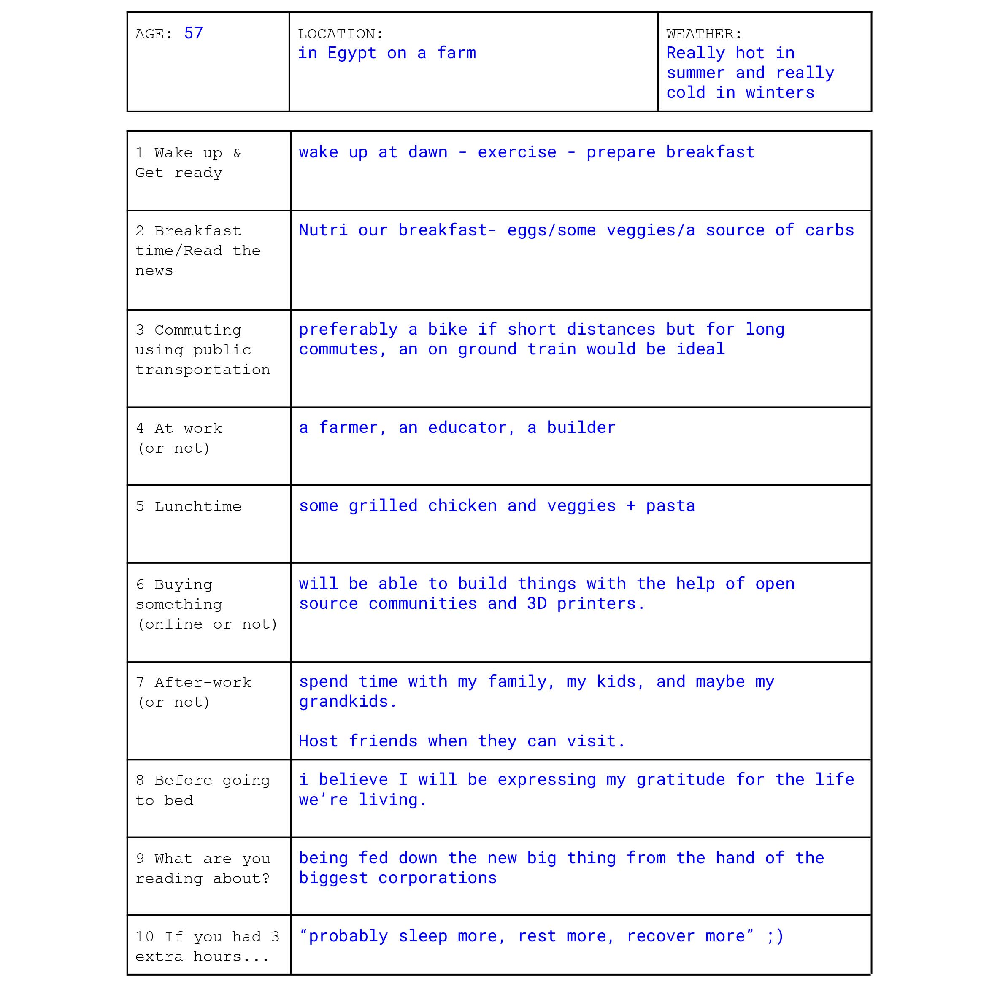

---
hide:
    - toc
---

# designing for the next billion seconds
january_2023

some general thoughts about this module - intimidating title (not because of any reason other than the "billion"), speaking with Andres Colmenares, co-founder of IAM Studio, was absolutely lovely - he was quite a good facilitator for (non-tradition) concepts as well as a great ambassador for . (this text is too formal for my liking lol) 

this module of the course allowed us to reimagine a world that does not just have one "linear" future but instead multiple spiral futures. there was an emphasis on the use of critical hope as well as multiple hypothetical questions to discuss and reflect over differenct subjects of conversation. 

please check out "the everything manifesto" by IAM Studio **[here.](https://medium.com/iam-journal/the-everything-manifesto-a-thought-experiment-for-the-next-billion-seconds-bcd9b9c938dc)** if you want to learn more about the agency's philosophy.

one of the tools used as a medium of discussion is a survey type thing - "a day in my post-technological life (2054)", a billion seconds from now. 

we had a lot of interesting conversation but what caught my attention the most was the talk about de-growth as a concept of living. our reality now a days always revolves around growth - economy, wealth, skills, blah blah... etc. when actually there could be alot o benefits in the pursue of degrowth policies - less resources ussed, less over sea traveling, less carbon emission used, more reliance on local talent and practices. 

a gripe that i have with the world is how west-centric it is. someone in this little city in *insert your favourite european/north american country here* is doing something a certain way and the entire planet tries to copy because of this false sense of elitism. 

the favoritism of westerns in my land is quite surprising, it is absolutely insane how much more respect  a human who was born several thousand kilometers away from you gets in our third world countrties. funny how all our homes were attacked, looted, terrorized, destroyed thanks to all the previous "collonisers" and now we respect them more, we imitate them more, and funny enough we do our best to move to their lands and be one of them... 

i feel in order to build a better future we have to revisit the past, to understand how we were living when we were thriving. although i feel that there is an attack on knowledge and the world is trying to make us more stupid to control us easier. i am quite skeptical to believe if we will ever go back to the way life was and i believe the world will keep falling off until the selfish, money hungry, power craving individuals are called out and destroyed. 

that was a rant. was not really planned. was not on purpose. but reach out and we can talk about more if you'd like.

