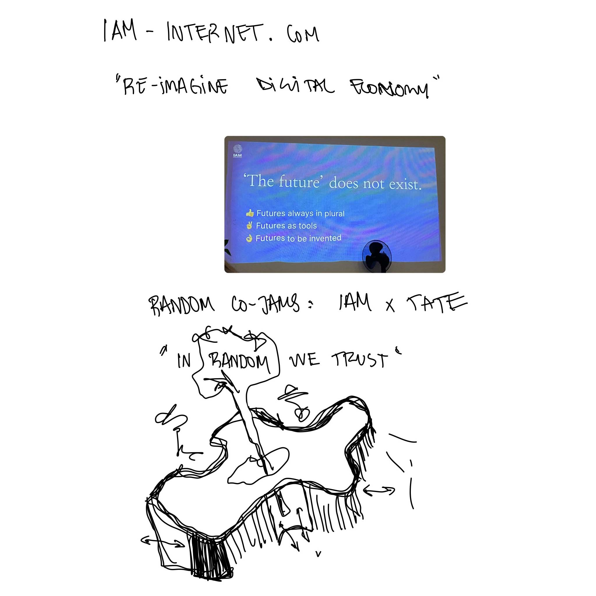
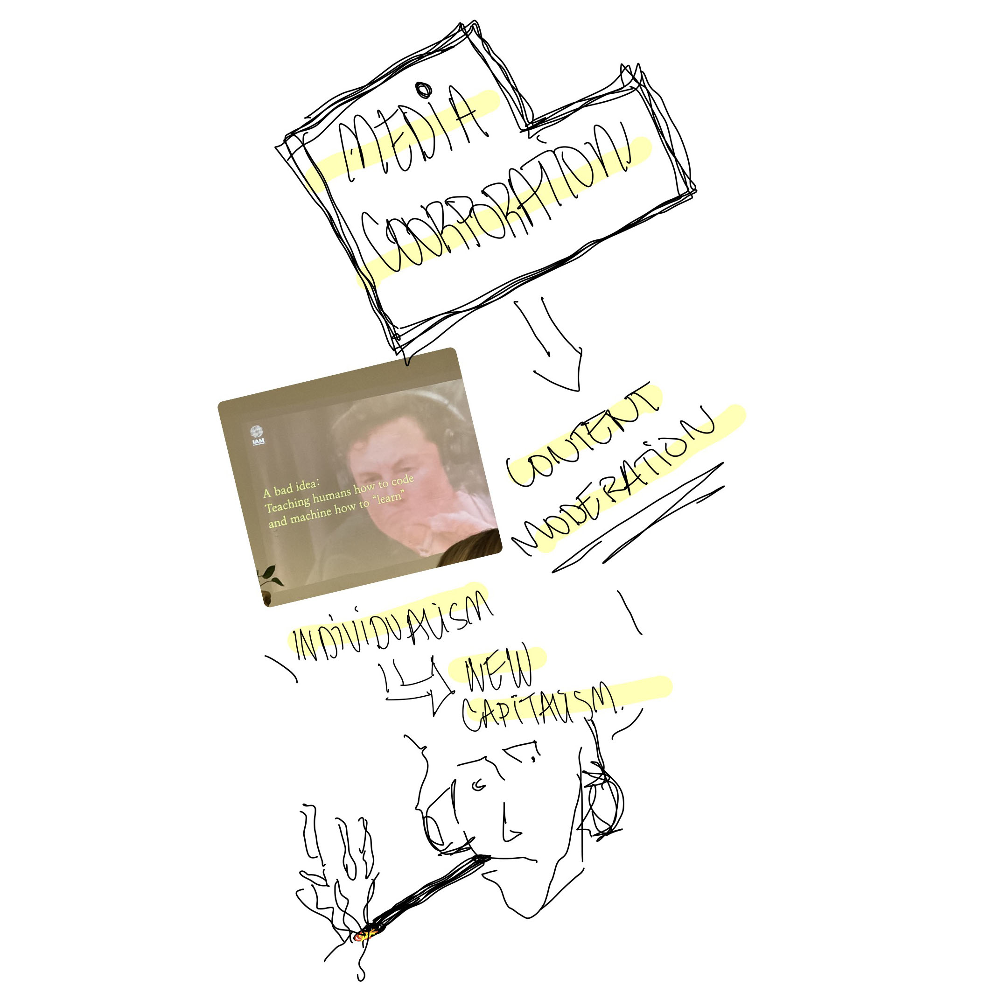

---
hide:
    - toc
---

# designing for the next billion seconds
january_2023

some general thoughts about this module - intimidating title (not because of any reason other than the "billion"), speaking with Andres Colmenares, co-founder of IAM Studio, was absolutely lovely - he was quite a good facilitator for (non-tradition) concepts as well as a great ambassador for . (this text is too formal for my liking lol) 

this module of the course allowed us to reimagine a world that does not just have one "linear" future but instead multiple spiral futures. there was an emphasis on the use of critical hope as well as multiple hypothetical questions to discuss and reflect over differenct subjects of conversation. 

please check out "the everything manifesto" by IAM Studio **[here.](https://medium.com/iam-journal/the-everything-manifesto-a-thought-experiment-for-the-next-billion-seconds-bcd9b9c938dc)** if you want to learn more about the agency's philosophy.

