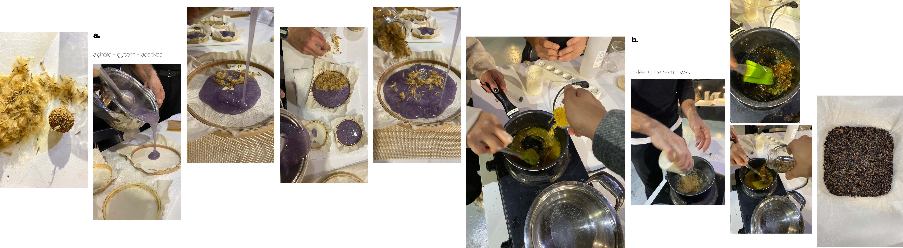

---
hide:
    - toc
---

# remixing materials
january_2023

## part 1.

under the expert guidance of laura campos, our remixing materials workshop came to life with a dynamic start! we were given an insightful glimpse into Simbiotica, laura's unique approach to using and experimenting with bio-materials. i was  drawn in by her engaging presentation, which sparked my imagination as she delved into the rich history of these materials, the intricacies of the design process, and the endless possibilities for design applications. It was a truly entertaining and enlightening experience that left a lasting impression.

we did a lot of then and there experiments using a material of our choice to create a leather object using a mold and a naturally occuring resin - as well as a synthetic natural leather as a small introduction to bio-materials. quite educational but it was not my favorite part of this module.  

we also got a chance to visit simbiotica's hradquarters and learn a bit more about mycelium - and how it is made and used in a design space. it was quite interesting to learn that it could be 3d printed and then stacked on top of each other and eventually bond with time because it is a self maintaing material. 

## part 2.

material narratives

we were tasked to choose and analyse 3 materials - one from the class references, one from around us, and one ideal material.

## part 3.

final presentation

after doing research about food waste and deciding to move forward with onion peels as an experimental base. we gathered a bunch and started "experimenting" - it was very eye-opening to see how fast material properties can change based on the environment it is kept in, also the additives we used had effects on drying time, there were plenty of learnings from this. it was interesting.

  <iframe loading="lazy" style="position: absolute; width: 100%; height: 100%; top: 0; left: 0; border: none; padding: 0;margin: 0;"
    src="https:&#x2F;&#x2F;www.canva.com&#x2F;design&#x2F;DAFadyHe094&#x2F;view?embed" allowfullscreen="allowfullscreen" allow="fullscreen">
  </iframe>

<a href="https:&#x2F;&#x2F;www.canva.com&#x2F;design&#x2F;DAFadyHe094&#x2F;view?utm_content=DAFadyHe094&amp;utm_campaign=designshare&amp;utm_medium=embeds&amp;utm_source=link" target="_blank" rel="noopener">

__AY