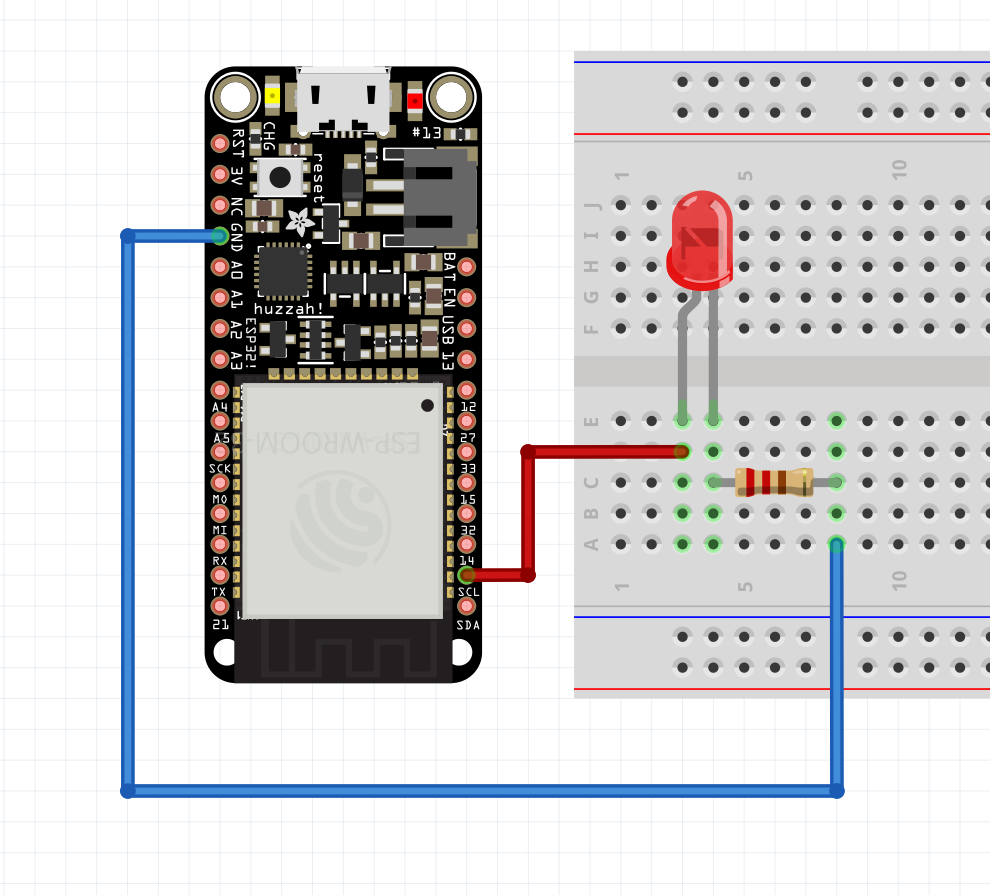

---
hide:
    - toc
---

# 03_networking-and-interfaces_

## section a
*intro to networks*

During the networking class with Victor, we received an introduction to creating a network using the Arduino software and local server. Working in teams, we attempted to connect to Victor's computer through the local server and Arduino software interface, particularly the serial monitor.

To establish a connection with Victor's computer, we had to modify specific parts of the code on Arduino. Firstly, we downloaded the PunSubClient library and changed the Wifi name and password in the code to connect to the local network. Additionally, we modified the mqttClientuser (Victor), topicToSub, and mqttClientName (our team name). Marielle made some changes to the code as well, but I couldn't follow those parts. Nevertheless, we successfully modified the message we sent to Victor's computer and avoided using the generic "hello!" greeting.

my esp32 was fried, though. i needed to buy another board before doing this. i only participated as a group member.

## section b

in today's coding class, "beyond blink-breathe-burn," we really got into the nitty-gritty of programming. we started off with something as simple as turning on an LED, but boy did we learn that little issues like messed-up cables or the wrong resistor can totally throw things off.

thankfully, oscar was an awesome teacher and helped us work through some pretty challenging concepts. we built a basic LED circuit, used the "blink" command, and even got to connect to a network to mess with an LED online.

*blink schematics below*

*blink code below*

    #include "Arduino.h"
    #define LED_PIN 14

    // the setup function runs once when you press reset or power the board
    void setup() {
      // initialize digital pin LED_BUILTIN as an output.
      pinMode(LED_PIN, OUTPUT);
      Serial.begin(9600);
    }

    void blink () {
      digitalWrite(LED_PIN, HIGH);   // turn the LED on (HIGH is the voltage level)
       delay(1000);                       // wait for a second
      digitalWrite(LED_PIN, LOW);    // turn the LED off by making the voltage LOW
      delay(1000);                       // wait for a second
    }

    // the loop function runs over and over again forever
    void loop() {

      if (Serial.available()) {
        String newMsg = Serial.readString();
        newMsg.trim();

        Serial.print("Got new message!: ");
        Serial.println(newMsg);

        // blink if we tell it to!
        if (newMsg.equals("blink")){
          blink();
        }
      }
    }

we also covered more advanced stuff like "breathe" and "burn" commands, shortcuts for making our code cleaner, and how to define functions and use "if" and "else if" loops. it wasn't all easy, but i definitely feel like i learned a lot and am ready for more coding challenges. we needed to download jled in order to run the animations on our devices.

*jled code below_*

    #include "Arduino.h"
    #include "JLED.h"
    #define LED_PIN 14

    // Jled object.
    // More information here: https://github.com/jandelgado/jled#usage
    auto led = JLed(LED_PIN);

    // the setup function runs once when you press reset or power the board
    void setup() {
      Serial.begin(9600);
    }

    // Basic blink
    void blink () {
      led.Blink(1000, 600).Repeat(3);
    }

    // Smooth breathing
    void breathe() {
      led.Breathe(1000).Repeat(3);
    }

    // the loop function runs over and over again forever
    void loop() {

      if (Serial.available()) {
        // Read the string and clean it up
        String newMsg = Serial.readString();
        newMsg.trim();

        // For debugging purposes, print it
        Serial.print("Got new message!: ");
        Serial.println(newMsg);

        // Blink if we tell it to!
        if (newMsg.equals("blink")){
          blink();
        // Or breathe!
        } else if (newMsg.equals("breathe")) {
          breathe();
        }
      }
    
      // Do not remove this line!
      led.Update();
    }

one bummer was that the server got overloaded with so many people trying to connect at once. i had to reset my arduino a few times to get everything synced up. still, this was probably the most well-organized and helpful class we've had all semester!

  <iframe loading="lazy" style="position: absolute; width: 100%; height: 100%; top: 0; left: 0; border: none; padding: 0;margin: 0;"
    src="https:&#x2F;&#x2F;www.canva.com&#x2F;design&#x2F;DAFgdsaYafo&#x2F;watch?embed" allowfullscreen="allowfullscreen" allow="fullscreen">
  </iframe>

<a href="https:&#x2F;&#x2F;www.canva.com&#x2F;design&#x2F;DAFgdsaYafo&#x2F;watch?utm_content=DAFgdsaYafo&amp;utm_campaign=designshare&amp;utm_medium=embeds&amp;utm_source=link" target="_blank" rel="noopener">Design</a> by _AY

__AY