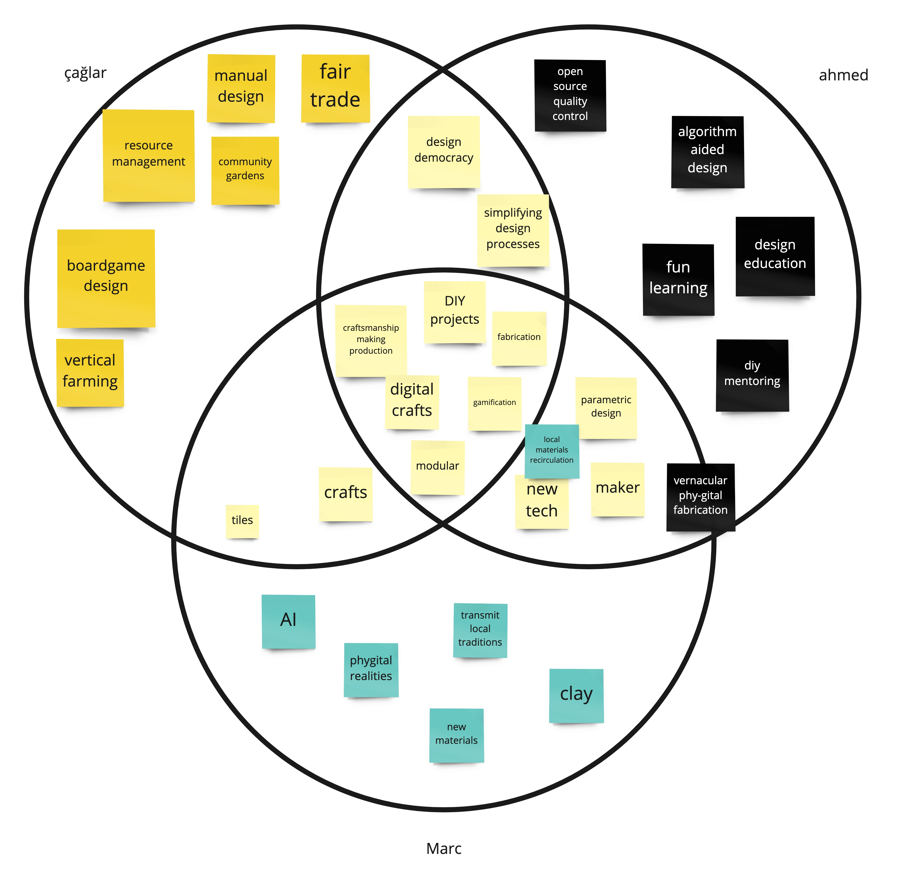

---
hide:
    - toc
---

# micro  challenge #1
february_2023

**tile deco** w/ caglar and marc

*play in the physical - convert to the digital*

### project alignment
we started sharing our interests and discussing the fields we wanted to investigate in order to implement them into our interventions. these three circles illustrate the intersection of our main interests.

    //defining key concepts_

      - diy projects
      - fabrication
      - modular
      - digital crafts
      - making/production
      - gamification

based on these concepts, we determined that we wanted to delve into the modularity of diy design. specifically, we aimed to explore how to simplify the design process by employing a clear methodology that combines physical and digital tools. to accomplish this, we established three stages:

**stage 1** - 2D tile scale design pattern

**stage 2** - 3D facade iteration

**stage 3** - public installation

    project inspiration__

  <iframe loading="lazy" style="position: absolute; width: 100%; height: 100%; top: 0; left: 0; border: none; padding: 0;margin: 0;"    src="https:&#x2F;&#x2F;www.canva.com&#x2F;design&#x2F;DAFi52aesXU&#x2F;view?embed" allowfullscreen="allowfullscreen" allow="fullscreen">  </iframe>
<a href="https:&#x2F;&#x2F;www.canva.com&#x2F;design&#x2F;DAFi52aesXU&#x2F;view?utm_content=DAFi52aesXU&amp;utm_campaign=designshare&amp;utm_medium=embeds&amp;utm_source=link" target="_blank" rel="noopener">tile-deco_inspiration</a> by _AY

### **project development**

initially, we discussed both 3D and 2D options, and ultimately decided to concentrate on the 2D alternative. for a basic tile decoration, we required vinyl designs that would be attached to a stencil to transfer the ceramic ink. rather than supplying pre-made patterns, stickers, or vinyls, we opted to create a grid board that would enable users to create their own distinct designs.

based on these concepts, we determined that we wanted to delve into the modularity of DIY design. specifically, we aimed to explore how to simplify the design process

    design process_

      1. grid board
      2. geometric pieces
      3. pattern design
      4. photo digitalisation
      5. vinyl cutting
      6. stencil making
      7. tile production
      8. pattern building

#### grid board

a diy tool kit was developed to create unique tile patterns and combinations.

  <iframe loading="lazy" style="position: absolute; width: 100%; height: 100%; top: 0; left: 0; border: none; padding: 0;margin: 0;"
    src="https:&#x2F;&#x2F;www.canva.com&#x2F;design&#x2F;DAFj1IIkRXM&#x2F;view?embed" allowfullscreen="allowfullscreen" allow="fullscreen">
  </iframe>

<a href="https:&#x2F;&#x2F;www.canva.com&#x2F;design&#x2F;DAFj1IIkRXM&#x2F;view?utm_content=DAFj1IIkRXM&amp;utm_campaign=designshare&amp;utm_medium=embeds&amp;utm_source=link" target="_blank" rel="noopener">board-design</a> by _AY

during the grid board design process, efforts were made to prevent shading and reflections that would negatively impact the vinyl's photo-digitalization quality. however, due to the defined acrylic thickness and magnet sizes, these issues couldn't be completely eliminated. to address this, the acrylic surfaces were covered with a matte vinyl, which improved the photo-digitalization quality by reducing reflections. although the vinyl transfer onto the grid board proved to be challenging, the team was able to improve the design through trial and error, ultimately achieving satisfactory results with the third vinyl design.

#### geometric pieces

we encountered an additional predicament pertaining to the incompatibility of certain geometric pieces utilized in the generation of the tile decoration design. some of these pieces were equipped with a solitary magnet, resulting in an unstable positioning on the grid. (during the presentation, one of the constructive criticisms suggested augmenting the size of the grid board as an optimal solution to this predicament.)

one of the noteworthy discoveries entailed developing an efficient methodology to affix the magnets without incurring wastage. we conducted experiments with varying aperture dimensions in the acrylic board to ascertain the most suitable fit. additionally, we employed vinyl to envelop each facet of the acrylic, thereby ensuring steadfast retention of the magnets. however, if the need arises to disassemble the pieces, the vinyl can be effortlessly detached.

#### photo digitalisation

the process of digitalization is an exciting journey! after trying out different methods and testing various versions, we decided to move from an analogue, physical process to a digital process. to begin with, we placed the tile in a well-lit space, preferably with natural light to avoid shadows. a softbox was useful in ensuring the best scan results (and it can be created at home if you're feeling adventurous!). after capturing the image and adjusting the contrast levels (using any available tool - we used photoshop, but free alternatives such as gimp or pixlr are great too), we only proceeded when we obtained a full black and white image.

the following step involved uploading the image to a vector-based software, such as illustrator (or whichever software is available). illustrator has a built-in feature for image tracing that produces a vectorized result. though the outcomes are not always perfect (and some adjustments may be necessary), we were able to use the image trace and manually redraw the stencil outline for a cleaner result.

once the outlines were obtained, it was easy to scale them appropriately (in our case, the tiles were 150mm x 150mm) and get the negatives of the shapes. it's also crucial to flip the shapes to achieve the desired pattern when applying ink.

although the process took us about an hour to complete, we are continuously seeking ways to simplify the physical-to-digital conversion so that anyone can do it from the comfort of their own home. additionally, we intend to develop a tool that will allow users to visualize their patterns more quickly after aggregating them.

literally one of the best weeks of the course so far. i always love it when the fabacademy staff are involved. 

  <iframe loading="lazy" style="position: absolute; width: 100%; height: 100%; top: 0; left: 0; border: none; padding: 0;margin: 0;"
    src="https:&#x2F;&#x2F;www.canva.com&#x2F;design&#x2F;DAFavYB6CeY&#x2F;view?embed" allowfullscreen="allowfullscreen" allow="fullscreen">
  </iframe>

<a href="https:&#x2F;&#x2F;www.canva.com&#x2F;design&#x2F;DAFavYB6CeY&#x2F;view?utm_content=DAFavYB6CeY&amp;utm_campaign=designshare&amp;utm_medium=embeds&amp;utm_source=link" target="_blank" rel="noopener">Tile Deco</a> by caglaralkan

__AY