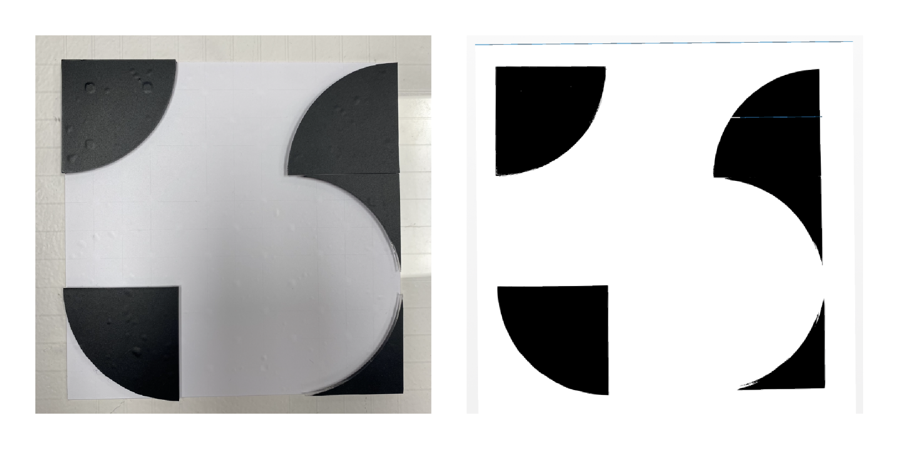
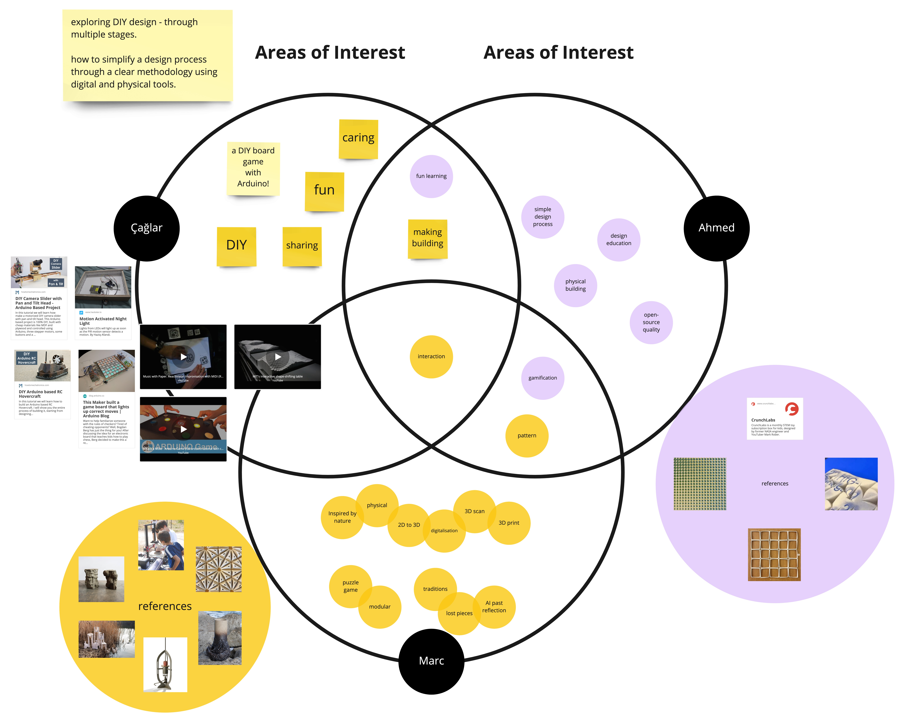
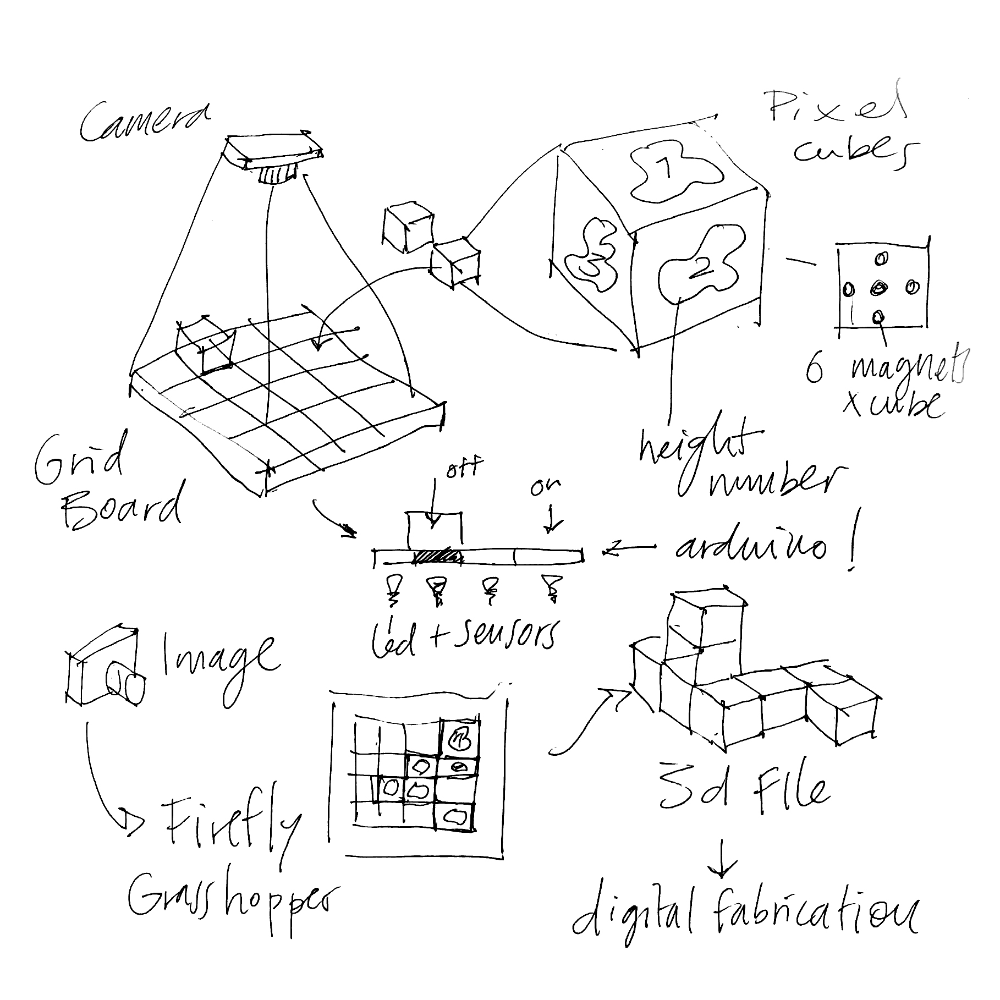

---
hide:
    - toc
---

## // micro-challenge #1
february_2023

**tile deco** w/ caglar and marc

*play in the physical - convert to the digital*

### project alignment
we started sharing our interests and discussing the fields we wanted to investigate in order to implement them into our interventions. these three circles illustrate the intersection of our main interests.

    // defining key concepts_

      - diy projects
      - fabrication
      - modular
      - digital crafts
      - making/production
      - gamification

based on these concepts, we determined that we wanted to delve into the modularity of diy design. specifically, we aimed to explore how to simplify the design process by employing a clear methodology that combines physical and digital tools. to accomplish this, we established three stages:

**stage 1** - 2D tile scale design pattern

**stage 2** - 3D facade iteration

**stage 3** - public installation

    // project inspiration__

  <iframe loading="lazy" style="position: absolute; width: 100%; height: 100%; top: 0; left: 0; border: none; padding: 0;margin: 0;"    src="https:&#x2F;&#x2F;www.canva.com&#x2F;design&#x2F;DAFi52aesXU&#x2F;view?embed" allowfullscreen="allowfullscreen" allow="fullscreen">  </iframe>
<a href="https:&#x2F;&#x2F;www.canva.com&#x2F;design&#x2F;DAFi52aesXU&#x2F;view?utm_content=DAFi52aesXU&amp;utm_campaign=designshare&amp;utm_medium=embeds&amp;utm_source=link" target="_blank" rel="noopener">tile-deco_inspiration</a> by _AY

### **project development**

initially, we discussed both 3D and 2D options, and ultimately decided to concentrate on the 2D alternative. for a basic tile decoration, we required vinyl designs that would be attached to a stencil to transfer the ceramic ink. rather than supplying pre-made patterns, stickers, or vinyls, we opted to create a grid board that would enable users to create their own distinct designs.

based on these concepts, we determined that we wanted to explore the modularity of DIY design. specifically, we aimed to explore how to simplify the design process

    // design process_

      1. grid board
      2. geometric pieces
      3. pattern design
      4. photo digitalisation
      5. vinyl cutting
      6. stencil making
      7. tile production
      8. pattern building

#### grid board

a diy tool kit was developed to create unique tile patterns and combinations.

  <iframe loading="lazy" style="position: absolute; width: 100%; height: 100%; top: 0; left: 0; border: none; padding: 0;margin: 0;"
    src="https:&#x2F;&#x2F;www.canva.com&#x2F;design&#x2F;DAFj1IIkRXM&#x2F;view?embed" allowfullscreen="allowfullscreen" allow="fullscreen">
  </iframe>

<a href="https:&#x2F;&#x2F;www.canva.com&#x2F;design&#x2F;DAFj1IIkRXM&#x2F;view?utm_content=DAFj1IIkRXM&amp;utm_campaign=designshare&amp;utm_medium=embeds&amp;utm_source=link" target="_blank" rel="noopener">i_building-process (tile-deco)</a> by _AY

during the grid board design process, efforts were made to prevent shading and reflections that would negatively impact the vinyl's photo-digitalization quality. however, due to the defined acrylic thickness and magnet sizes, these issues couldn't be completely eliminated. to address this, the acrylic surfaces were covered with a matte vinyl, which improved the photo-digitalization quality by reducing reflections. although the vinyl transfer onto the grid board proved to be challenging, the team was able to improve the design through trial and error, ultimately achieving satisfactory results with the third vinyl design.

#### geometric pieces

we encountered an additional predicament pertaining to the incompatibility of certain geometric pieces utilized in the generation of the tile decoration design. some of these pieces were equipped with a solitary magnet, resulting in an unstable positioning on the grid. (during the presentation, one of the constructive criticisms suggested augmenting the size of the grid board as an optimal solution to this predicament.)

one of the noteworthy discoveries entailed developing an efficient methodology to affix the magnets without incurring wastage. we conducted experiments with varying aperture dimensions in the acrylic board to ascertain the most suitable fit. additionally, we employed vinyl to envelop each facet of the acrylic, thereby ensuring steadfast retention of the magnets. however, if the need arises to disassemble the pieces, the vinyl can be effortlessly detached.

#### photo digitalisation

the process of digitalization is an exciting journey! after trying out different methods and testing various versions, we decided to move from an analogue, physical process to a digital process. to begin with, we placed the tile in a well-lit space, preferably with natural light to avoid shadows. a softbox was useful in ensuring the best scan results (and it can be created at home if you're feeling adventurous!). after capturing the image and adjusting the contrast levels (using any available tool - we used photoshop, but free alternatives such as gimp or pixlr are great too), we only proceeded when we obtained a full black and white image.

the following step involved uploading the image to a vector-based software, such as illustrator (or whichever software is available). illustrator has a built-in feature for image tracing that produces a vectorized result. though the outcomes are not always perfect (and some adjustments may be necessary), we were able to use the image trace and manually redraw the stencil outline for a cleaner result.

once the outlines were obtained, it was easy to scale them appropriately (in our case, the tiles were 150mm x 150mm) and get the negatives of the shapes. it's also crucial to flip the shapes to achieve the desired pattern when applying ink.

although the process took us about an hour to complete, we are continuously seeking ways to simplify the physical-to-digital conversion so that anyone can do it from the comfort of their own home. additionally, we intend to develop a tool that will allow users to visualize their patterns more quickly after aggregating them.

    // literally one of the best weeks of the course so far. 
    i always love it when the fabacademy staff are involved.

  <iframe loading="lazy" style="position: absolute; width: 100%; height: 100%; top: 0; left: 0; border: none; padding: 0;margin: 0;"
    src="https:&#x2F;&#x2F;www.canva.com&#x2F;design&#x2F;DAFavYB6CeY&#x2F;view?embed" allowfullscreen="allowfullscreen" allow="fullscreen">
  </iframe>

<a href="https:&#x2F;&#x2F;www.canva.com&#x2F;design&#x2F;DAFavYB6CeY&#x2F;view?utm_content=DAFavYB6CeY&amp;utm_campaign=designshare&amp;utm_medium=embeds&amp;utm_source=link" target="_blank" rel="noopener">Tile Deco</a> by caglaralkan

**resources**

 - link to original repo **[here](https://github.com/paresmarc/tiledeco)**

## //micro challenge #2
april_2023

**pixelcubes** w/caglar and marc

*modular system to create digital models through physical interaction.*

### project alignment
we decided to continue the first challenge and develop iterations to improve it and make the process more automated.

initially, we devised a tile decorating kit in Challenge I, which prompted us to embark on further development. our primary objective revolved around enhancing accessibility and user-friendliness through digitalization. moreover, we sought to elevate the kit from a two-dimensional (2D) platform to a three-dimensional (3D) realm. the overarching aspiration was to employ this project as an experimental arena for delving into 3D fabrication, serving as an intermediary between physical objects and their digital counterparts.

    // interventions: research project_

    - create digital models through physical interaction
    - how to transform a difficult process into a game
    - how to define a DIY Kit to allow everyone to create 3D models
    - create a process between physical and digital.

### project development

for reference, we conducted research on notable reference projects like mit's interactive shape-shifting table and reactivision improvisation with midi (reactable). nevertheless, time limitations compelled us to streamline our objectives and simplify them.

    // design steps_

    - interactive physical modular system to create myriad volumes (cubes)
    - research around webcam detection software of movement and rotation of shapes (Fiducial ID, Firefly)
    - how to combine and assemble cubes in order to create volumes (magnets, polarity).
    - make the user interact with the software. 
    - incorporate Arduino (button to restart)

    // artifact description_

    - physical Interactive space with cubes like pixels.
    - recombine the locations of cubes to create myriad combinations.
    - each cube has a Reactable Fiducial ID on each face.
    - a camera connected to Firefly, Grasshopper detect and know the location and height of each cube.
    - once the cubes have the desired shape, the camera scans them and generates a volume.
    - export a 3D file and reproduce it with digital fabrication machines.

### digitalization process

we started by directing focusing on the digitalization process. through research, we found a system known as "fiducial id," which operates via cameras and shares similarities with qr codes. distinct from qr codes, fiducial ids encompass more organic shapes. to capture the fiducial ids, we employed grasshopper-rhinoceros in conjunction with a plug-in program named "firefly." each cube is positioned on the grid and possesses a distinctive "fiducial id," embedding into it a parameter that translates it to the digital environment.

    // fiducial ids_

    // firefly x grasshopper test

    // assign fiducial ids to shapes

### kit building

we also worked on the physical object, which consisted of cubes made of wood. initially, we had 3d printed the cubes, which were made of two parts and used six magnets. however, this method was not appropriate because it took three hours to print each cube. therefore, we decided to build the cubes out of wood and insert the magnets on surfaces.

to ensure free availability while interacting with the cubes, we used sphere-shaped magnets that could move inside a cavity and position themselves in the precise polarity to connect with the magnet of the next cube. we designed a magnet insert for each magnet to solve that problem, and we 3d printed them with a sla printer with resin.

    // cubes building process

  <iframe loading="lazy" style="position: absolute; width: 100%; height: 100%; top: 0; left: 0; border: none; padding: 0;margin: 0;"
    src="https:&#x2F;&#x2F;www.canva.com&#x2F;design&#x2F;DAFj1b1B_xY&#x2F;view?embed" allowfullscreen="allowfullscreen" allow="fullscreen">
  </iframe>

<a href="https:&#x2F;&#x2F;www.canva.com&#x2F;design&#x2F;DAFj1b1B_xY&#x2F;view?utm_content=DAFj1b1B_xY&amp;utm_campaign=designshare&amp;utm_medium=embeds&amp;utm_source=link" target="_blank" rel="noopener">ii_building-process (cubes)</a> by _AY 

    *the slides sometimes lag -  may show a different set of slides. in case of repetition, please click the link to view.

we also used the cnc machine to build the grid with plywood. we designed and laser-cut acrylic to create a structure that held the camera above the grid. this structure could be moved around to different positions on the grid for capturing the cubes clearly.

    // cam-structure building process

  <iframe loading="lazy" style="position: absolute; width: 100%; height: 100%; top: 0; left: 0; border: none; padding: 0;margin: 0;"
    src="https:&#x2F;&#x2F;www.canva.com&#x2F;design&#x2F;DAFj8Um2fW4&#x2F;view?embed" allowfullscreen="allowfullscreen" allow="fullscreen">
  </iframe>

<a href="https:&#x2F;&#x2F;www.canva.com&#x2F;design&#x2F;DAFj8Um2fW4&#x2F;view?utm_content=DAFj8Um2fW4&amp;utm_campaign=designshare&amp;utm_medium=embeds&amp;utm_source=link" target="_blank" rel="noopener">ii_base_building-process (cubes)</a> by _AY

    // firefly code_

          /* 
     Created by Andrew Payne
     Modified from original Firefly Firmata written by Jason Kelly Johnson and Andrew Payne
     Latest Update September 10th, 2012 
     Copyright 2012 | All Rights Reserved
     
     This Firmata allows you to control an Arduino board from Rhino/Grasshopper/Firefly.
     Updates, Questions, Suggestions visit: http://www.fireflyexperiments.com
     
     1. Plug Arduino boards into your USB port; confirm that your Arduino's green power LED in on
     2. Select your specific Arduino Board and Serial Port (Tools > Board; Tools > Serial Port) *Take note of your Serial Port COM #
     3. Verify (play button) and Upload (upload button) this program to your Arduino, close the Arduino program
     4. then open ... Rhino/Grasshopper/Firefly
     
     Note: The Firefly Firmata sets the following pins to perform these functions:
     
     *****ON STANDARD BOARDS (ie. Uno, Diecimila, Duemilanove, Lillypad, Mini, etc.)*****
     ANALOG IN pins 0-5 are set to return values (from 0 to 1023) for analog sensors
     DIGITAL IN pins 2,4,7 will return 0's or 1's; for 3 potential digital sensors (buttons, switches, on/off, true/false, etc.)
     DIGITAL/ANALOG OUT pins 3,5,6,11 (marked with a ~) can be used to digitalWrite, analogWrite, or Servo.write depending on the input status of that Firefly pin
     DIGITAL OUT pins 8,9,10,12,13 can be used to digitalWrite, Servo.write, or analogWrite depending on the input status of that Firefly pin
     
     *****ON MEGA BOARDS (ie. ATMEGA1280, ATMEGA2560)*****
     ANALOG IN pins 0-15 will return values (from 0 to 1023) for 16 potential analog sensors 
     DIGITAL IN pins 34-41 will return 0's or 1's; for 8 potential digital sensors (buttons, switches, on/off, true/false, etc.) 
     DIGITAL/ANALOG OUT pins 2-13 can be used to digitalWrite, analogWrite, or Servo.write depending on the input status of that Firefly pin
     DIGITAL OUT pins 22-33 can be used to digitalWrite, Servo.write, or analogWrite depending on the input status of that Firefly pin
     
     *****ON LEONARDO BOARDS*****
     ANALOG IN pins 0-5 are set to return values (from 0 to 1023) for analog sensors
     DIGITAL IN pins 2,4,7 will return 0's or 1's; for 3 potential digital sensors (buttons, switches, on/off, true/false, etc.)
     DIGITAL/ANALOG OUT pins 3,5,6,11 (marked with a ~) can be used to digitalWrite, analogWrite, or Servo.write depending on the input status of that Firefly pin
     DIGITAL OUT pins 8,9,10,12,13 can be used to digitalWrite, Servo.write, or analogWrite depending on the input status of that Firefly pin
     */

    #include <Servo.h>            // attach Servo library (http://www.arduino.cc/playground/ComponentLib/Servo)
    #include <pins_arduino.h>     // attach arduino pins header file to determine which board type is being used

    #define BAUDRATE 115200       // Set the Baud Rate to an appropriate speed
    #define BUFFSIZE 512          // buffer one command at a time, 12 bytes is longer than the max length

    /*==============================================================================
     * GLOBAL VARIABLES
     *============================================================================*/

    char buffer[BUFFSIZE];        // declare buffer
    uint8_t bufferidx = 0;        // a type of unsigned integer of length 8 bits
    char *parseptr;
    char buffidx;

    int counter = 0;
    int numcycles = 1000;

    #if defined(__AVR_ATmega328P__) || defined(__AVR_ATmega168__)                         // declare variables for STANDARD boards
      uint16_t APin0, APin1, APin2, APin3, APin4, APin5, DPin2, DPin4, DPin7;             // declare input variables
      uint16_t DPin3, DPin5, DPin6, DPin8, DPin9, DPin10, DPin11, DPin12, DPin13;         // declare output variables  
      Servo Servo3, Servo5, Servo6, Servo8, Servo9, Servo10, Servo11, Servo12, Servo13;   // declare Servo objects
    #endif

    #if defined(__AVR_ATmega32U4__) || defined(__AVR_ATmega16U4__)                        // declare variables for LEONARDO board
      uint16_t APin0, APin1, APin2, APin3, APin4, APin5, DPin2, DPin4, DPin7;             // declare input variables
      uint16_t DPin3, DPin5, DPin6, DPin8, DPin9, DPin10, DPin11, DPin12, DPin13;         // declare output variables  
      Servo Servo3, Servo5, Servo6, Servo8, Servo9, Servo10, Servo11, Servo12, Servo13;   // declare Servo objects
    #endif

    #if defined(__AVR_ATmega1280__) || defined(__AVR_ATmega2560__)                        // declare variables for MEGA boards
      uint16_t APin0, APin1, APin2, APin3, APin4, APin5, APin6, APin7, APin8, APin9, APin10, APin11, APin12, APin13, APin14, APin15, DPin22, DPin23, DPin24, DPin25, DPin26, DPin27, DPin28, DPin29, DPin30, DPin31;  // declare input variables
      uint16_t DPin2, DPin3, DPin4, DPin5, DPin6, DPin7, DPin8, DPin9, DPin10, DPin11, DPin12, DPin13, DPin32, DPin33, DPin34, DPin35, DPin36, DPin37, DPin38, DPin39, DPin40, DPin41, DPin42, DPin43, DPin44, DPin45, DPin46, DPin47, DPin48, DPin49, DPin50, DPin51, DPin52, DPin53;  // declare output variables  
      Servo Servo2, Servo3, Servo4, Servo5, Servo6, Servo7, Servo8, Servo9, Servo10, Servo11, Servo12, Servo13, Servo32, Servo33, Servo34, Servo35, Servo36, Servo37, Servo38, Servo39, Servo40, Servo41, Servo42, Servo43, Servo44, Servo45, Servo46, Servo47, Servo48, Servo49, Servo50, Servo51, Servo52, Servo53;  // declare Servo objects
    #endif

    /*==============================================================================
     * SETUP() This code runs once
     *============================================================================*/
    void setup()
    { 
      Init();                  //set initial pinmodes
      Serial.begin(BAUDRATE);  // Start Serial communication
    }

    /*==============================================================================
     * LOOP() This code loops
     *============================================================================*/
    void loop()
    {
      if(Serial){
        ReadSerial();                       // read and parse string from serial port and write to pins
        if (counter >= numcycles){          // Wait every nth loop 
          ReadInputs();                     // get input data
          PrintToPort();                    // print data to serial port 
          counter = 0;                      // reset the counter
        }
        counter ++;                         // increment the writecounter
      }
    }

    /*==============================================================================
     * FUNCTIONS()
     *============================================================================*/

    void Init(){
      #if defined(__AVR_ATmega328P__) || defined(__AVR_ATmega168__)    //set pin mode for STANDARD boards
        pinMode(2, INPUT); 
        pinMode(4, INPUT); 
        pinMode(7, INPUT);
      #endif
      
      #if defined(__AVR_ATmega32U4__) || defined(__AVR_ATmega16U4__)   //set pin mode for LEONARDO board
        pinMode(2, INPUT); 
        pinMode(4, INPUT); 
        pinMode(7, INPUT);
      #endif
      
      #if defined(__AVR_ATmega1280__) || defined(__AVR_ATmega2560__)  //set pin mode for MEGA boards
        pinMode(22, INPUT); 
        pinMode(23, INPUT);
        pinMode(24, INPUT);
        pinMode(25, INPUT);
        pinMode(26, INPUT); 
        pinMode(27, INPUT);
        pinMode(28, INPUT); 
        pinMode(29, INPUT);
        pinMode(30, INPUT);
        pinMode(31, INPUT); 
      #endif
    }

    void ReadInputs(){ 
      #if defined(__AVR_ATmega328P__) || defined(__AVR_ATmega168__)    //read pins on STANDARD boards
        APin0 = analogRead(0);   
        APin1 = analogRead(1);  
        APin2 = analogRead(2); 
        APin3 = analogRead(3); 
        APin4 = analogRead(4); 
        APin5 = analogRead(5); 
        DPin2 = digitalRead(2);  
        DPin4 = digitalRead(4);  
        DPin7 = digitalRead(7); 
      #endif
      
      #if defined(__AVR_ATmega32U4__) || defined(__AVR_ATmega16U4__)   //read pins on LEONARDO board
        APin0 = analogRead(0);   
        APin1 = analogRead(1);  
        APin2 = analogRead(2); 
        APin3 = analogRead(3); 
        APin4 = analogRead(4); 
        APin5 = analogRead(5); 
        DPin2 = digitalRead(2);  
        DPin4 = digitalRead(4);  
        DPin7 = digitalRead(7); 
      #endif
      
      #if defined(__AVR_ATmega1280__) || defined(__AVR_ATmega2560__)  //read pins on MEGA boards
        APin0 = analogRead(0); 
        APin1 = analogRead(1); 
        APin2 = analogRead(2); 
        APin3 = analogRead(3); 
        APin4 = analogRead(4); 
        APin5 = analogRead(5); 
        APin6 = analogRead(6); 
        APin7 = analogRead(7); 
        APin8 = analogRead(8); 
        APin9 = analogRead(9); 
        APin10 = analogRead(10); 
        APin11 = analogRead(11); 
        APin12 = analogRead(12); 
        APin13 = analogRead(13); 
        APin14 = analogRead(14); 
        APin15 = analogRead(15); 
        DPin22 = digitalRead(22);  
        DPin23 = digitalRead(23);  
        DPin24 = digitalRead(24);  
        DPin25 = digitalRead(25);  
        DPin26 = digitalRead(26); 
        DPin27 = digitalRead(27); 
        DPin28 = digitalRead(28);  
        DPin29 = digitalRead(29);  
        DPin30 = digitalRead(30);  
        DPin31 = digitalRead(31);
      #endif
    }

    void PrintToPort(){
      #if defined(__AVR_ATmega328P__) || defined(__AVR_ATmega168__)    //print formatted string for STANDARD boards
        Serial.print(APin0); Serial.print(",");  
        Serial.print(APin1); Serial.print(","); 
        Serial.print(APin2); Serial.print(","); 
        Serial.print(APin3); Serial.print(","); 
        Serial.print(APin4); Serial.print(","); 
        Serial.print(APin5); Serial.print(","); 
        Serial.print(DPin2); Serial.print(","); 
        Serial.print(DPin4); Serial.print(","); 
        Serial.print(DPin7); Serial.print(","); 
        Serial.println("eol");  //end of line marker
      #endif
      
      #if defined(__AVR_ATmega32U4__) || defined(__AVR_ATmega16U4__)   //print formatted string for LEONARDO boards
        Serial.print(APin0); Serial.print(",");  
        Serial.print(APin1); Serial.print(","); 
        Serial.print(APin2); Serial.print(","); 
        Serial.print(APin3); Serial.print(","); 
        Serial.print(APin4); Serial.print(","); 
        Serial.print(APin5); Serial.print(","); 
        Serial.print(DPin2); Serial.print(","); 
        Serial.print(DPin4); Serial.print(","); 
        Serial.print(DPin7); Serial.print(","); 
        Serial.println("eol");  //end of line marker
      #endif
      
      #if defined(__AVR_ATmega1280__) || defined(__AVR_ATmega2560__)  //print formatted string for MEGA boards
        Serial.print(APin0); Serial.print(","); 
        Serial.print(APin1); Serial.print(","); 
        Serial.print(APin2); Serial.print(","); 
        Serial.print(APin3); Serial.print(",");   
        Serial.print(APin4); Serial.print(","); 
        Serial.print(APin5); Serial.print(",");   
        Serial.print(APin6); Serial.print(",");
        Serial.print(APin7); Serial.print(",");  
        Serial.print(APin8); Serial.print(",");  
        Serial.print(APin9); Serial.print(","); 
        Serial.print(APin10); Serial.print(",");  
        Serial.print(APin11); Serial.print(","); 
        Serial.print(APin12); Serial.print(","); 
        Serial.print(APin13); Serial.print(","); 
        Serial.print(APin14); Serial.print(",");  
        Serial.print(APin15); Serial.print(","); 
        Serial.print(DPin22); Serial.print(","); 
        Serial.print(DPin23); Serial.print(","); 
        Serial.print(DPin24); Serial.print(",");
        Serial.print(DPin25); Serial.print(",");   
        Serial.print(DPin26); Serial.print(","); 
        Serial.print(DPin27); Serial.print(",");  
        Serial.print(DPin28); Serial.print(","); 
        Serial.print(DPin29); Serial.print(","); 
        Serial.print(DPin30); Serial.print(","); 
        Serial.print(DPin31); Serial.print(",");  
        Serial.println("eol");  //end of line marker
      #endif
    }

    void ReadSerial(){
      char c;    // holds one character from the serial port
      if (Serial.available()) {
        c = Serial.read();         // read one character
        buffer[bufferidx] = c;     // add to buffer

        if (c == '\n') {  
          buffer[bufferidx+1] = 0; // terminate it
          parseptr = buffer;       // offload the buffer into temp variable

          #if defined(__AVR_ATmega328P__) || defined(__AVR_ATmega168__)  //parse string for STANDARD boards
            DPin13 = parsedecimal(parseptr);     // parse the first number
            parseptr = strchr(parseptr, ',')+1;  // move past the ","
            
            DPin12 = parsedecimal(parseptr);     // parse the second number
            parseptr = strchr(parseptr, ',')+1;  // move past the ","
      
            DPin11 = parsedecimal(parseptr);     // parse the third number
            parseptr = strchr(parseptr, ',')+1;  // move past the ","
      
            DPin10 = parsedecimal(parseptr);     // parse the fourth number
            parseptr = strchr(parseptr, ',')+1;  // move past the ","
      
            DPin9 = parsedecimal(parseptr);      // parse the fifth number
            parseptr = strchr(parseptr, ',')+1;  // move past the ","
      
            DPin8 = parsedecimal(parseptr);      // parse the sixth number
            parseptr = strchr(parseptr, ',')+1;  // move past the ","
      
            DPin6 = parsedecimal(parseptr);      // parse the seventh number
            parseptr = strchr(parseptr, ',')+1;  // move past the ","
      
            DPin5 = parsedecimal(parseptr);      // parse the eighth number
            parseptr = strchr(parseptr, ',')+1;  // move past the ","
      
            DPin3 = parsedecimal(parseptr);      // parse the ninth number
            
            WriteToPin(13, DPin13, Servo13);     //send value out to pin on arduino board
            WriteToPin(12, DPin12, Servo12);
            WriteToPin(11, DPin11, Servo11);
            WriteToPin(10, DPin10, Servo10);
            WriteToPin(9, DPin9, Servo9);
            WriteToPin(8, DPin8, Servo8);
            WriteToPin(6, DPin6, Servo6);
            WriteToPin(5, DPin5, Servo5);
            WriteToPin(3, DPin3, Servo3);
             
          #endif
          
          #if defined(__AVR_ATmega32U4__) || defined(__AVR_ATmega16U4__)  //parse string for LEONARDO boards
            DPin13 = parsedecimal(parseptr);     // parse the first number
            parseptr = strchr(parseptr, ',')+1;  // move past the ","
      
            DPin12 = parsedecimal(parseptr);     // parse the second number
            parseptr = strchr(parseptr, ',')+1;  // move past the ","
      
            DPin11 = parsedecimal(parseptr);     // parse the third number
            parseptr = strchr(parseptr, ',')+1;  // move past the ","
      
            DPin10 = parsedecimal(parseptr);     // parse the fourth number
            parseptr = strchr(parseptr, ',')+1;  // move past the ","
      
            DPin9 = parsedecimal(parseptr);      // parse the fifth number
            parseptr = strchr(parseptr, ',')+1;  // move past the ","
      
            DPin8 = parsedecimal(parseptr);      // parse the sixth number
            parseptr = strchr(parseptr, ',')+1;  // move past the ","
      
            DPin6 = parsedecimal(parseptr);      // parse the seventh number
            parseptr = strchr(parseptr, ',')+1;  // move past the ","
      
            DPin5 = parsedecimal(parseptr);      // parse the eighth number
            parseptr = strchr(parseptr, ',')+1;  // move past the ","
      
            DPin3 = parsedecimal(parseptr);      // parse the ninth number
            
            WriteToPin(13, DPin13, Servo13);     //send value out to pin on arduino board
            WriteToPin(12, DPin12, Servo12);
            WriteToPin(11, DPin11, Servo11);
            WriteToPin(10, DPin10, Servo10);
            WriteToPin(9, DPin9, Servo9);
            WriteToPin(8, DPin8, Servo8);
            WriteToPin(6, DPin6, Servo6);
            WriteToPin(5, DPin5, Servo5);
            WriteToPin(3, DPin3, Servo3);
            
          #endif
          
          #if defined(__AVR_ATmega1280__) || defined(__AVR_ATmega2560__)  //parse string for MEGA boards
            DPin2 = parsedecimal(parseptr);       // parse the first number
            parseptr = strchr(parseptr, ',')+1;   // move past the ","
      
            DPin3 = parsedecimal(parseptr);       // parse the second number
            parseptr = strchr(parseptr, ',')+1;   // move past the ","
      
            DPin4 = parsedecimal(parseptr);       // parse the third number
            parseptr = strchr(parseptr, ',')+1;   // move past the ","
      
            DPin5 = parsedecimal(parseptr);       // parse the fourth number
            parseptr = strchr(parseptr, ',')+1;   // move past the ","
      
            DPin6 = parsedecimal(parseptr);       // parse the fifth number
            parseptr = strchr(parseptr, ',')+1;   // move past the ","
      
            DPin7 = parsedecimal(parseptr);       // parse the sixth number
            parseptr = strchr(parseptr, ',')+1;   // move past the ","
      
            DPin8 = parsedecimal(parseptr);       // parse the seventh number
            parseptr = strchr(parseptr, ',')+1;   // move past the ","
      
            DPin9 = parsedecimal(parseptr);       // parse the eighth number
            parseptr = strchr(parseptr, ',')+1;   // move past the ","
      
            DPin10 = parsedecimal(parseptr);      // parse the ninth number
            parseptr = strchr(parseptr, ',')+1;   // move past the ","
            
            DPin11 = parsedecimal(parseptr);      // parse the tenth number
            parseptr = strchr(parseptr, ',')+1;   // move past the ","
            
            DPin12 = parsedecimal(parseptr);      // parse the eleventh number
            parseptr = strchr(parseptr, ',')+1;   // move past the ","
            
            DPin13 = parsedecimal(parseptr);      // parse the twelvth number
            parseptr = strchr(parseptr, ',')+1;   // move past the ","
            
            DPin32 = parsedecimal(parseptr);      // parse the thirteenth number
            parseptr = strchr(parseptr, ',')+1;   // move past the ","
      
            DPin33 = parsedecimal(parseptr);      // parse the fourteenth number
            parseptr = strchr(parseptr, ',')+1;   // move past the ","
            
            DPin34 = parsedecimal(parseptr);      // parse the fifthteenth number
            parseptr = strchr(parseptr, ',')+1;   // move past the ","
            
            DPin35 = parsedecimal(parseptr);      // parse the sixteenth number
            parseptr = strchr(parseptr, ',')+1;   // move past the ","
            
            DPin36 = parsedecimal(parseptr);      // parse the seventeenth number
            parseptr = strchr(parseptr, ',')+1;   // move past the ","
            
            DPin37 = parsedecimal(parseptr);      // parse the eightteenth number
            parseptr = strchr(parseptr, ',')+1;   // move past the ","
            
            DPin38 = parsedecimal(parseptr);      // parse the nineteenth number
            parseptr = strchr(parseptr, ',')+1;   // move past the ","
            
            DPin39 = parsedecimal(parseptr);      // parse the twentieth number
            parseptr = strchr(parseptr, ',')+1;   // move past the ","
            
            DPin40 = parsedecimal(parseptr);      // parse the twenty first number
            parseptr = strchr(parseptr, ',')+1;   // move past the ","
            
            DPin41 = parsedecimal(parseptr);      // parse the twenty second number
            parseptr = strchr(parseptr, ',')+1;   // move past the ","
            
            DPin42 = parsedecimal(parseptr);      // parse the twenty third number
            parseptr = strchr(parseptr, ',')+1;   // move past the ","
            
            DPin43 = parsedecimal(parseptr);      // parse the twenty fourth number
            parseptr = strchr(parseptr, ',')+1;   // move past the ","
            
            DPin44 = parsedecimal(parseptr);      // parse the twenty fifth number
            parseptr = strchr(parseptr, ',')+1;   // move past the ","
            
            DPin45 = parsedecimal(parseptr);      // parse the twenty sixth number
            parseptr = strchr(parseptr, ',')+1;   // move past the ","
            
            DPin46 = parsedecimal(parseptr);      // parse the twenty seventh number
            parseptr = strchr(parseptr, ',')+1;   // move past the ","
            
            DPin47 = parsedecimal(parseptr);      // parse the twenty eigth number
            parseptr = strchr(parseptr, ',')+1;   // move past the ","
            
            DPin48 = parsedecimal(parseptr);      // parse the twenty ninth number
            parseptr = strchr(parseptr, ',')+1;   // move past the ","
            
            DPin49 = parsedecimal(parseptr);      // parse the thirtieth number
            parseptr = strchr(parseptr, ',')+1;   // move past the ","
            
            DPin50 = parsedecimal(parseptr);      // parse the thirty one number
            parseptr = strchr(parseptr, ',')+1;   // move past the ","
            
            DPin51 = parsedecimal(parseptr);      // parse the thirty second number
            parseptr = strchr(parseptr, ',')+1;   // move past the ","
            
            DPin52 = parsedecimal(parseptr);      // parse the thirty third number
            parseptr = strchr(parseptr, ',')+1;   // move past the ","
            
            DPin53 = parsedecimal(parseptr);      // parse the thirty fourth number
            
            WriteToPin(2, DPin2, Servo2);         //send value out to pin on arduino board
            WriteToPin(3, DPin3, Servo3);
            WriteToPin(4, DPin4, Servo4);
            WriteToPin(5, DPin5, Servo5);
            WriteToPin(6, DPin6, Servo6);
            WriteToPin(7, DPin7, Servo7);
            WriteToPin(8, DPin8, Servo8);
            WriteToPin(9, DPin9, Servo9);
            WriteToPin(10, DPin10, Servo10);
            WriteToPin(11, DPin11, Servo11);
            WriteToPin(12, DPin12, Servo12);
            WriteToPin(13, DPin13, Servo13);
            WriteToPin(32, DPin32, Servo32);
            WriteToPin(33, DPin33, Servo33);
            WriteToPin(34, DPin34, Servo34);
            WriteToPin(35, DPin35, Servo35);
            WriteToPin(36, DPin36, Servo36);
            WriteToPin(37, DPin37, Servo37);
            WriteToPin(38, DPin38, Servo38);
            WriteToPin(39, DPin39, Servo39);
            WriteToPin(40, DPin40, Servo40);
            WriteToPin(41, DPin41, Servo41);
            WriteToPin(42, DPin42, Servo42);
            WriteToPin(43, DPin43, Servo43);
            WriteToPin(44, DPin44, Servo44);
            WriteToPin(45, DPin45, Servo45);
            WriteToPin(46, DPin46, Servo46);
            WriteToPin(47, DPin47, Servo47);
            WriteToPin(48, DPin48, Servo48);
            WriteToPin(49, DPin49, Servo49);
            WriteToPin(50, DPin50, Servo50);
            WriteToPin(51, DPin51, Servo51);
            WriteToPin(52, DPin52, Servo52);
            WriteToPin(53, DPin53, Servo53);
            
          #endif
          
          bufferidx = 0;                             // reset the buffer for the next read
          return;                                    // return so that we don't trigger the index increment below
        }                                            // didn't get newline, need to read more from the buffer
        bufferidx++;                                 // increment the index for the next character
        if (bufferidx == BUFFSIZE-1) bufferidx = 0;  // if we get to the end of the buffer reset for safety
      }
    }

    void WriteToPin(int _pin, int _value, Servo _servo){
    if (_value >= 1000 && _value < 2000)             // check if value should be used for Digital Write (HIGH/LOW)
    {      
      if (_servo.attached()) _servo.detach();        // detach servo is one is attached to pin
      pinMode(_pin, OUTPUT);                         // sets the pin for output 
      _value -=1000;                                 // subtract 1000 from the value sent from Firefly 
      if (_value == 1) digitalWrite(_pin, HIGH);     // Digital Write to pin
      else digitalWrite(_pin, LOW);   
    }   
    else if (_value >= 2000 && _value < 3000)        // check if value should be used for Analog Write (0-255)
    {
      if (_servo.attached()) _servo.detach();        // detach servo is one is attached to pin
      pinMode(_pin, OUTPUT);                         // sets the pin for output 
      _value -= 2000;                                // subtract 2000 from the value sent from Firefly
      analogWrite(_pin, _value);                     // Analog Write to pin
    }
    else if (_value >= 3000 && _value < 4000)        // check if value should be used for Servo Write (0-180)
    {
      _value -= 3000;                                // subtract 3000 from the value sent from Firefly
      if (!_servo.attached())_servo.attach(_pin);    // attaches a Servo to the PWM pin (180 degree standard servos)                                    
      _servo.write(_value);                          // Servo Write to the pin
      }
    }

    uint32_t parsedecimal(char *str){
      uint32_t d = 0;
      while (str[0] != 0) {
        if ((str[0] > '50') || (str[0] < '0'))
          return d;
        d *= 10;
        d += str[0] - '0';
        str++;
      }
      return d;
    }

this code is necessary to upload to the arduino uno in order to activate the *grasshopper x firefly* link. this code will link the digital grasshopper commands to a physical button (that was in our case).

// possibilities are endless - here is a **[youtube channel](https://www.youtube.com/@TroyBaverstock)** i found quite useful when i was doing my research 

    // final presentation

  <iframe loading="lazy" style="position: absolute; width: 100%; height: 100%; top: 0; left: 0; border: none; padding: 0;margin: 0;"
    src="https:&#x2F;&#x2F;www.canva.com&#x2F;design&#x2F;DAFddcJntxw&#x2F;view?embed" allowfullscreen="allowfullscreen" allow="fullscreen">
  </iframe>

<a href="https:&#x2F;&#x2F;www.canva.com&#x2F;design&#x2F;DAFddcJntxw&#x2F;view?utm_content=DAFddcJntxw&amp;utm_campaign=designshare&amp;utm_medium=embeds&amp;utm_source=link" target="_blank" rel="noopener">Pixel Cubes</a> by Marc Parés

**resources**

 - link to original repo **[here](https://github.com/paresmarc/pixelcubes)**

__AY