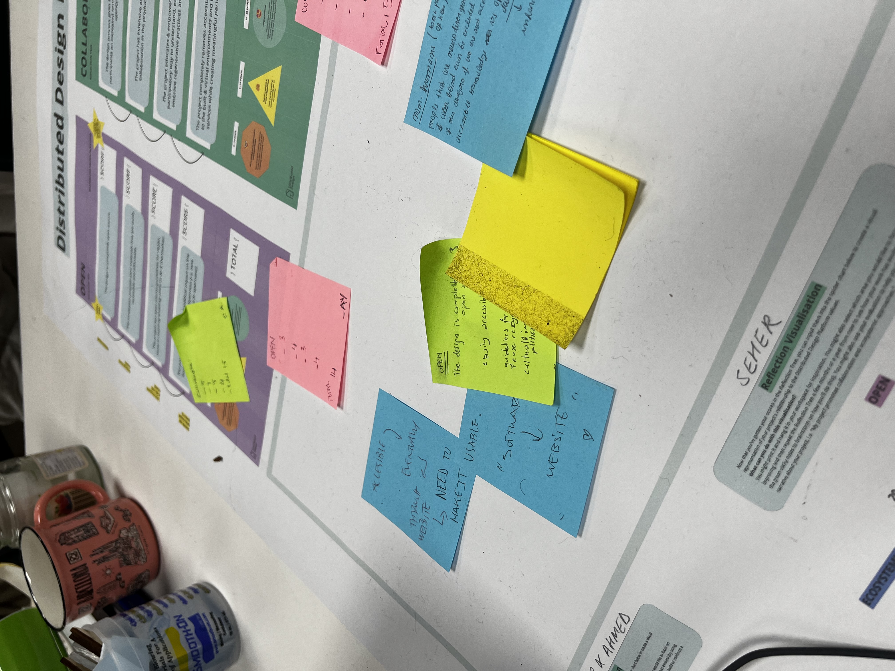
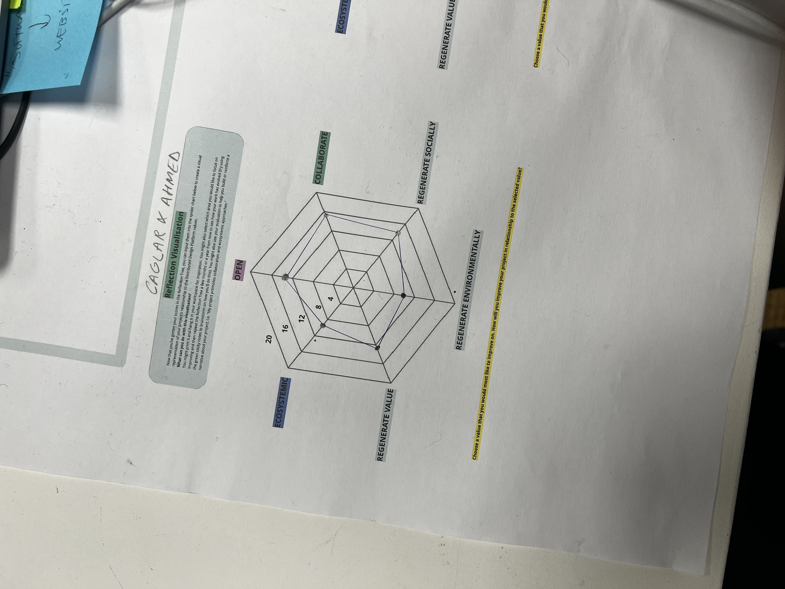
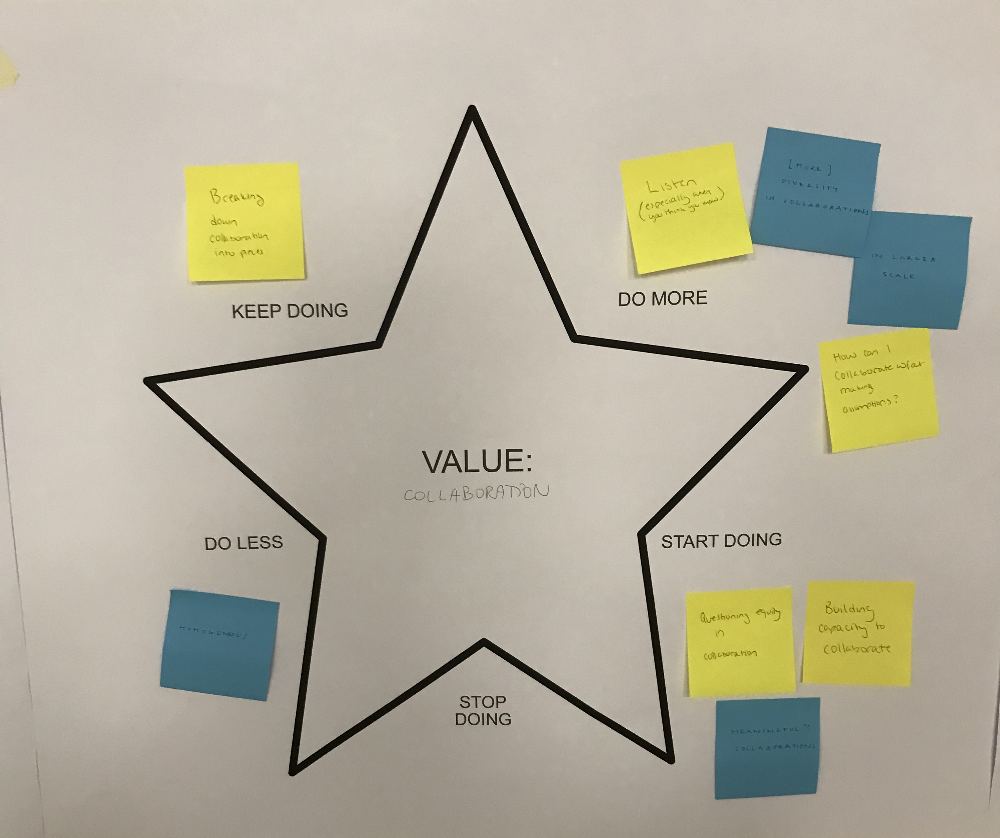

---
hide:
    - toc
---

# distributed design
april 2023

to begin, we formed groups and used the mushroom model to examine a specific object, product or service. in our group, we focused on a plastic hair-clip. we then visited other groups who were examining chatgpt, fertilizer, and bread to ask and share questions. each group followed the model's structure, starting with the making section and ending with the power section. upon returning to our own tables, we shared our interactions and our representative also shared her interaction with the guests. one significant aspect was the feedback we received on the cultural value of the hair-clip and the various ways a seemingly simple product can be represented.

so, we worked on the distributed design platform reflection tree by ourselves and noted our scores. then we shared and talked about our scores for different values and aspects. we all agreed on some common points, especially about being open-source. we realized that being open-source doesn't mean it's easy to replicate. basically, if we want our projects to be useful, we need to make sure the descriptions and resources are easy to understand. otherwise, it won't be helpful for anyone who's interested. oh, and except for seher's project, we also noticed that we weren't focused on the value of regenerating the environment.

on the second day of learning, we focused on developing skills such as participation, collaboration, integration, and patience. we explored horizontal dynamics and engaged in active interactions with our peers. i was particularly interested in my teammates' projects, which encouraged me to be more involved in the group.

during the final day of the lecture, we primarily focused on the value of collaboration. i worked with some classmates to create a presentation on this topic. from my perspective, the primary impact of collaboration is the ability to develop together. this means sharing knowledge, experiences, and tools/equipment to achieve a common goal as a group.

on the third day of our learning, we focused on developing our skills in participation, collaboration, integration, and teamwork. we engaged in horizontal, active, participatory, and creative dynamics with one another. it was exciting to work in a team and share our different perspectives. despite the limited time, we all prepared a presentation, presented it, and received feedback from our classmates.

  <iframe loading="lazy" style="position: absolute; width: 100%; height: 100%; top: 0; left: 0; border: none; padding: 0;margin: 0;"
    src="https:&#x2F;&#x2F;www.canva.com&#x2F;design&#x2F;DAFhapFbKvg&#x2F;view?embed" allowfullscreen="allowfullscreen" allow="fullscreen">
  </iframe>

<a href="https:&#x2F;&#x2F;www.canva.com&#x2F;design&#x2F;DAFhapFbKvg&#x2F;view?utm_content=DAFhapFbKvg&amp;utm_campaign=designshare&amp;utm_medium=embeds&amp;utm_source=link" target="_blank" rel="noopener">Copy of Untitled</a> by _AY

__AY