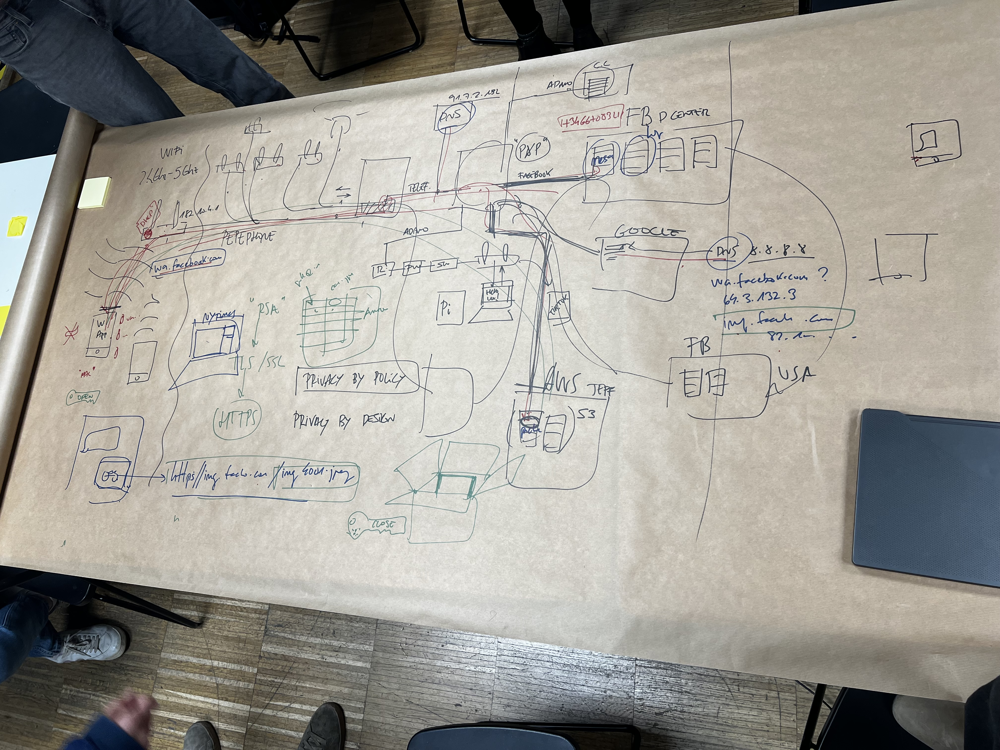
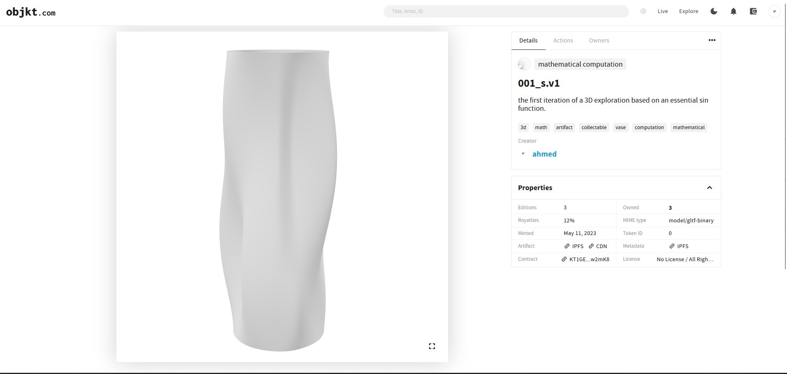

---
hide:
    - toc
---

# decentralized autonomous organizations
may 2023

## part a_
*with Guillem*

during the first class with guillem, we explored the fascinating realm of digital formats and protocols, with a specific focus on keywords like bitcoin, nfts, blockchain, crypto trends, emerging technologies, and decentralized systems. guillem prompted us to spontaneously list the first things that came to mind upon hearing these terms. initially, we couldn't help but feel disconnected from these topics, questioning whether they were merely transient trends created by a select group,seeking to channel financial investments into their own pockets.

however, as the classes progressed and we delved deeper into the subject matter, my perspective on these emerging technologies underwent a significant shift. if we were to respond to guillem's initial question now, we would emphasize that these innovations represent alternative means of exchanging goods. they are the result of collective endeavors aimed at reshaping narratives and establishing more suitable protocols and stories that align with our increasingly digital world.

i must admit that my initial judgment was influenced by a degree of condescension and hastiness. yet, as we dedicated more time and attention to exploring these topics, i came to appreciate the intricacies of communication systems and the extensive collaborative efforts they entail. the notion of decentralized systems and transparent transactions challenged my preconceived notions, raising questions about their potential to democratize access to financial services and foster artistic expression. what i initially dismissed as mere "trends" actually held immense possibilities and transformative potential.

## part 2_
*with Mar Canet*

10 industries that blockchain will disrupt in the future:

    banking
    cybersecurity
    supply chain management
    healthcare
    government
    insurance
    transportation
    cloud storage
    real estate
    art and design

the class covered the topic of digital arts and nfts, mainly. we went over what the blockchain was and its intersection with arts and artifical intelligence. we also had a discussion about the future of banking and finances with the boom in the cryptocurrency that has been going on for the past few years. this concept was not foreign to me, eventhough i felt no interest to learn about it generally, i found myself really indulged in the class and its content. 

mar was generous enough to share a small amount of crypto (tezos) - for us to understand the basics of traffic fees, nft market fees, and just to experience the life of a seller. 

i created a series of three of a "mathematical computational" vase and uploaded it on **[objkt.com](https://objkt.com/asset/KT1GE8HJRbnh5UUk1PP6zLwMUvf1tmCw2mK8/0)** - no one even placed an offer though. a lesson to understand the importance of a digital presence in todays day and age. 

    if you want.. you could.. place an offer.. <3

lastly we had to create a conceptal nft network with an active system and goals. i chose to go the **[jonas lund](https://jonaslund.com/)** route and have the people who would potenially be my fans pay for all the content i give out. 

its not really meant to be taken super serious, just a fun way to get consumers involved rather than, ultimately, only buying an asset. in my case the content would be tutorials to teach how a certain algorithm works. 

  <iframe loading="lazy" style="position: absolute; width: 100%; height: 100%; top: 0; left: 0; border: none; padding: 0;margin: 0;"
    src="https:&#x2F;&#x2F;www.canva.com&#x2F;design&#x2F;DAFiss_-kCc&#x2F;view?embed" allowfullscreen="allowfullscreen" allow="fullscreen">
  </iframe>

<a href="https:&#x2F;&#x2F;www.canva.com&#x2F;design&#x2F;DAFiss_-kCc&#x2F;view?utm_content=DAFiss_-kCc&amp;utm_campaign=designshare&amp;utm_medium=embeds&amp;utm_source=link" target="_blank" rel="noopener">pay to learn</a> by _AY

basically creating an onlyfans (halal version) for nfts.

__AY